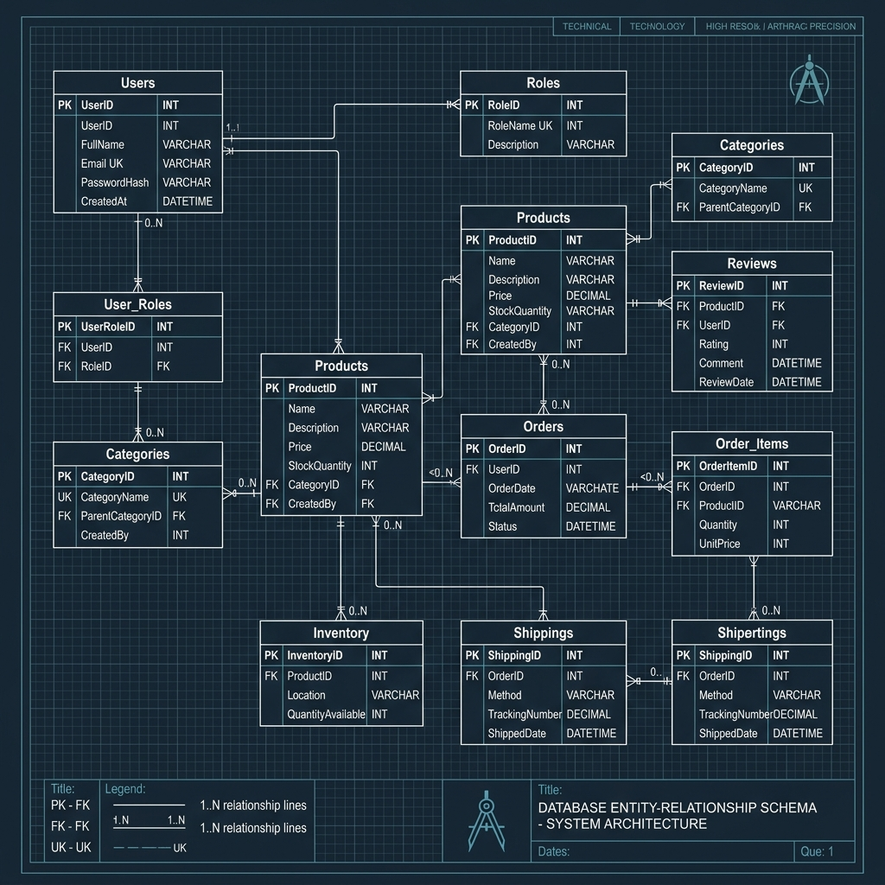
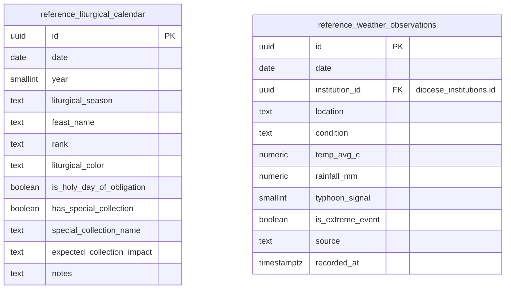

# Diocese of San Pablo — Database Columns Relational Diagram

### Visual Schema ER Diagram (Graphic Preview)
To view the full visual relational diagram as a graphic, open the **`database_columns_diagram.png`** file directly in your VS Code File Explorer sidebar on the left.

---

This document contains standard-compliant Mermaid Entity-Relationship Diagrams (ERDs) representing every table, column, and relationship defined in the database column specification document.

To view these diagrams visually inside VS Code, open the **Markdown Preview** by pressing `Ctrl + Shift + V` (or `Cmd + Shift + V` on Mac), or click the split-pane icon in the top-right corner.

---

## 1. Operational Layer (OLTP Schema Connections)

This diagram shows how user access privileges (RBAC), capital projects, and entity-specific transaction records connect via the central **`diocese_institutions`** super-type table to enforce strict database referential integrity.

```mermaid
erDiagram
    %% CORE ADMINISTRATIVE SCHEMAS
    diocese_institutions {
        uuid id PK
        text name
        text entity_type
        text vicariate
        text district
        text cluster
        text class
        text address
        text contact_number
        text email
        numeric lat
        numeric lng
        boolean is_active
    }
    diocese_roles {
        text id PK
        text name
        text color
        boolean is_predefined
    }
    diocese_permissions {
        text id PK
        text name
        text category
        text description
    }
    diocese_role_permissions {
        text role_id PK, FK
        text permission_id PK, FK
        boolean granted
    }
    diocese_profiles {
        uuid id PK
        text full_name
        text email
        text role_id FK
        uuid institution_id FK
        text contact_number
        boolean is_active
        timestamptz last_login_at
    }
    diocese_projects {
        uuid id PK
        uuid institution_id FK
        text name
        text description
        text fund_usage
        text category
        text status
        numeric target_amount
        numeric current_amount
        numeric total_expenses
        date start_date
        date end_date
        text beneficiaries
        text contact_person
        text cover_image
        numeric health_score
        numeric success_probability
        text recommendation
    }
    diocese_donations {
        uuid id PK
        uuid project_id FK
        text donor_name
        numeric amount
        date date
        text payment_method
        boolean receipt_issued
        text receipt_proof_name
        text notes
    }
    diocese_project_expenses {
        uuid id PK
        uuid project_id FK
        text description
        numeric amount
        date date
        text payment_method
        text receipt_reference
        text proof_file_name
        text notes
    }
    diocese_announcements {
        uuid id PK
        text title
        text content
        text author
        text author_role
        text priority
        text category
    }
    diocese_audit_logs {
        uuid id PK
        text log_reference
        text user_name
        text role
        boolean is_system
        text category
        text severity
        text action
        text detail
        uuid institution_id FK
        text ip_address
        timestamptz occurred_at
    }
    diocese_priest_assignments {
        uuid id PK
        uuid profile_id FK
        uuid institution_id FK
        text role_id FK
        date start_date
        date end_date
        text status
        text decree_reference
    }

    %% PARISHES OPERATIONAL SCHEMA
    parishes_details {
        uuid institution_id PK, FK
        text pastor
        text primary_patron
        text secondary_patron
        date fiesta_date
    }
    parishes_financial_records {
        uuid id PK
        uuid institution_id FK
        text entity_class
        text month
        smallint year
        text status
        text prepared_by
        text certified_by
        timestamptz submitted_at
        timestamptz record_timestamp
        numeric sacraments_total
        numeric confirmation_total
        numeric mass_intentions_total
        numeric mass_intentions_claimed
        numeric mass_intentions_unclaimed
        numeric mass_collection_weekday
        numeric mass_collection_sunday
        numeric mass_collection_saturday
        numeric consumable_collections
        numeric other_collections_total
        numeric donations
        numeric interest_income
        numeric subsidy_inflow
        numeric special_collections
        numeric second_collections
        numeric charge_over_above
        numeric other_receipts
        numeric priest_share
        numeric mass_stipend
        numeric other_pastoral_expenses
        numeric salaries_wages_benefits
        numeric govt_contributions
        numeric utilities
        numeric communications
        numeric other_rectory_expenses
        numeric construction_receipts
        numeric construction_expenses
        numeric remittance_to_diocese
        numeric bishops_fund_share
        numeric special_collections_remittance
        numeric beginning_balance
        numeric ending_balance_before_remit
        numeric ending_balance_after_remit
        numeric net_receipts
        numeric pastoral_parish_fund_total_net_receipts
    }
    parishes_fiesta_events {
        uuid id PK
        uuid institution_id FK
        text primary_patron
        text secondary_patron
        date date
        text expected_impact
        numeric estimated_collection_increase
    }
    parishes_local_calendar {
        uuid id PK
        uuid institution_id FK
        date event_date
        date end_date
        text title
        text event_type
        text expected_financial_impact
        numeric estimated_amount
        uuid linked_fiesta_id FK
        uuid linked_project_id FK
        text notes
    }

    %% SCHOOLS OPERATIONAL SCHEMA
    schools_details {
        uuid institution_id PK, FK
        text principal
        text level
        integer enrollment_count
        integer capacity_count
        integer staff_count
    }
    schools_financial_records {
        uuid id PK
        uuid institution_id FK
        text entity_class
        text month
        smallint year
        text status
        timestamptz record_timestamp
        numeric tuition_revenues
        numeric miscellaneous_fees
        numeric other_income
        numeric subsidy_inflow
        numeric faculty_payroll
        numeric admin_staff_payroll
        numeric utilities
        numeric facilities_maintenance
        numeric supplies
        numeric other_expenses
        numeric net_receipts
    }

    %% SEMINARIES OPERATIONAL SCHEMA
    seminaries_details {
        uuid institution_id PK, FK
        text rector
        integer enrollment_count
        integer capacity_count
        integer staff_count
    }
    seminaries_financial_records {
        uuid id PK
        uuid institution_id FK
        text entity_class
        text month
        smallint year
        text status
        timestamptz record_timestamp
        numeric donations
        numeric seminary_fees
        numeric mass_collections
        numeric other_sources
        numeric subsidy_inflow
        numeric tuition_fees
        numeric board_lodging_fees
        numeric drm_modules
        numeric sra_reading_lab
        numeric retreat
        numeric honorarium_fee
        numeric miscellaneous_fees
        numeric daily_food
        numeric food_others
        numeric gasoline_seminary
        numeric gasoline_vocation
        numeric permits_licenses
        numeric office_supplies
        numeric kitchen_equipment
        numeric medical_supplies
        numeric liturgical_supplies
        numeric construction_materials
        numeric other_supplies
        numeric lpg
        numeric repairs_maintenance
        numeric equipment_furniture
        numeric utilities
        numeric labor
        numeric professional_driver_fee
        numeric salaries_wages
        numeric contribution_benefits
        numeric cash_incentives
        numeric transportation_bank_charges
        numeric other_expenses
        numeric net_surplus
        numeric dependency_ratio
    }

    %% RELATIONSHIP MAPPINGS
    diocese_role_permissions }|--|| diocese_roles : "role_id"
    diocese_role_permissions }|--|| diocese_permissions : "permission_id"
    diocese_profiles }|--|| diocese_roles : "role_id"
    diocese_profiles }|--|| diocese_institutions : "institution_id"
    diocese_projects }|--|| diocese_institutions : "institution_id"
    diocese_donations }|--|| diocese_projects : "project_id"
    diocese_project_expenses }|--|| diocese_projects : "project_id"
    diocese_audit_logs }|--o| diocese_institutions : "institution_id"
    diocese_priest_assignments }|--|| diocese_profiles : "profile_id"
    diocese_priest_assignments }|--|| diocese_institutions : "institution_id"
    diocese_priest_assignments }|--|| diocese_roles : "role_id"

    %% Sub-type mappings (1:1 extensions of central institutions)
    parishes_details ||--|| diocese_institutions : "extends"
    schools_details ||--|| diocese_institutions : "extends"
    seminaries_details ||--|| diocese_institutions : "extends"

    %% Parish transactional linkages
    parishes_financial_records }|--|| diocese_institutions : "belongs_to"
    parishes_fiesta_events }|--|| diocese_institutions : "belongs_to"
    parishes_local_calendar }|--|| diocese_institutions : "belongs_to"
    parishes_local_calendar }|--o| parishes_fiesta_events : "linked_fiesta_id"
    parishes_local_calendar }|--o| diocese_projects : "linked_project_id"

    %% School transactional linkages
    schools_financial_records }|--|| diocese_institutions : "belongs_to"

    %% Seminary transactional linkages
    seminaries_financial_records }|--|| diocese_institutions : "belongs_to"
```

---

## 2. Analytics Layer (Star Schema OLAP Connections)

This diagram displays how the consolidated dimension tables (`dim_*`) connect to the core performance facts, time-series machine learning models, security anomalies, and LP budget optimization tables.

```mermaid
erDiagram
    dim_institutions {
        integer institution_key PK
        uuid institution_id
        text institution_name
        text entity_type
        text class
        numeric lat
        numeric lng
        boolean is_active
    }
    dim_parishes {
        integer institution_key PK, FK
        text vicariate
        text district
        text cluster
        text pastor
        text primary_patron
        text secondary_patron
        date fiesta_date
        text address
    }
    dim_schools {
        integer institution_key PK, FK
        text principal
        text level
        text address
    }
    dim_seminaries {
        integer institution_key PK, FK
        text rector
        text address
    }
    dim_date {
        integer date_key PK
        text month_name
        integer month_number
        text month_short
        integer year
        text quarter
        boolean academic_year_period
        boolean is_fiesta_season
    }
    dim_expense_categories {
        integer category_key PK
        text category_name
        text category_description
        text applies_to
    }
    dim_priests {
        integer priest_key PK
        uuid profile_id
        text full_name
        text email
        text contact_number
        boolean is_active
    }
    fact_parish_monthly_financials {
        integer institution_key PK, FK
        integer date_key PK, FK
        integer submission_key FK
        numeric sacraments_total
        numeric confirmation_total
        numeric mass_intentions_total
        numeric mass_intentions_claimed
        numeric mass_intentions_unclaimed
        numeric mass_collection_weekday
        numeric mass_collection_sunday
        numeric mass_collection_saturday
        numeric consumable_collections
        numeric other_collections_total
        numeric donations
        numeric interest_income
        numeric subsidy_inflow
        numeric special_collections
        numeric second_collections
        numeric charge_over_above
        numeric other_receipts
        numeric priest_share
        numeric mass_stipend
        numeric other_pastoral_expenses
        numeric salaries_wages_benefits
        numeric govt_contributions
        numeric utilities
        numeric communications
        numeric other_rectory_expenses
        numeric construction_receipts
        numeric construction_expenses
        numeric remittance_to_diocese
        numeric bishops_fund_share
        numeric special_collections_remittance
        numeric beginning_balance
        numeric ending_balance_before_remit
        numeric ending_balance_after_remit
        numeric total_inflow
        numeric total_outflow
        numeric net_receipts
        numeric pastoral_parish_fund_total_net_receipts
        smallint typhoon_days_count
        smallint major_events_count
        boolean has_fiesta
        numeric total_rainfall_mm
    }
    fact_school_monthly_financials {
        integer institution_key PK, FK
        integer date_key PK, FK
        integer submission_key FK
        numeric tuition_revenues
        numeric miscellaneous_fees
        numeric other_income
        numeric subsidy_inflow
        numeric faculty_payroll
        numeric admin_staff_payroll
        numeric utilities
        numeric facilities_maintenance
        numeric supplies
        numeric other_expenses
        numeric total_inflow
        numeric total_outflow
        numeric net_receipts
        smallint typhoon_days_count
        smallint major_events_count
        numeric total_rainfall_mm
    }
    fact_seminary_monthly_financials {
        integer institution_key PK, FK
        integer date_key PK, FK
        integer submission_key FK
        numeric donations
        numeric seminary_fees
        numeric mass_collections
        numeric other_sources
        numeric subsidy_inflow
        numeric tuition_fees
        numeric board_lodging_fees
        numeric drm_modules
        numeric sra_reading_lab
        numeric retreat
        numeric honorarium_fee
        numeric miscellaneous_fees
        numeric daily_food
        numeric food_others
        numeric gasoline_seminary
        numeric gasoline_vocation
        numeric permits_licenses
        numeric office_supplies
        numeric kitchen_equipment
        numeric medical_supplies
        numeric liturgical_supplies
        numeric construction_materials
        numeric other_supplies
        numeric lpg
        numeric repairs_maintenance
        numeric equipment_furniture
        numeric utilities
        numeric labor
        numeric professional_driver_fee
        numeric salaries_wages
        numeric contribution_benefits
        numeric cash_incentives
        numeric transportation_bank_charges
        numeric other_expenses
        numeric total_inflow
        numeric total_outflow
        numeric net_surplus
        numeric dependency_ratio
        smallint typhoon_days_count
        smallint major_events_count
        numeric total_rainfall_mm
    }
    fact_financial_forecasts {
        uuid forecast_id PK
        integer institution_key FK
        integer date_key FK
        text metric_type
        numeric predicted_value
        numeric lower_confidence
        numeric upper_confidence
        text model
        timestamptz generated_at
    }
    fact_anomaly_alerts {
        uuid alert_id PK
        integer institution_key FK
        integer date_key FK
        numeric anomaly_score
        boolean is_anomaly
        text severity_level
        text anomaly_type
        jsonb root_causes
        numeric confidence_score
        text analysis
        timestamptz detected_at
    }
    fact_health_snapshots {
        uuid snapshot_id PK
        integer institution_key FK
        integer date_key FK
        numeric composite_score
        numeric liquidity_score
        numeric sustainability_score
        numeric efficiency_score
        numeric stability_score
        numeric growth_score
        text trend
        numeric percentage_change
        text analysis
        jsonb recommendations
    }
    fact_subsidy_allocations {
        uuid allocation_id PK
        integer institution_key FK
        uuid run_key
        numeric annual_deficit
        numeric recommended_subsidy
        numeric allocated_subsidy
        timestamptz run_at
    }
    fact_priest_assignments {
        integer priest_key PK, FK
        integer institution_key PK, FK
        integer start_date_key PK, FK
        integer end_date_key FK
        text status
        boolean is_active
    }

    %% WAREHOUSE LINKAGES
    fact_parish_monthly_financials }|--|| dim_institutions : "institution_key"
    fact_parish_monthly_financials }|--|| dim_date : "date_key"

    fact_school_monthly_financials }|--|| dim_institutions : "institution_key"
    fact_school_monthly_financials }|--|| dim_date : "date_key"

    fact_seminary_monthly_financials }|--|| dim_institutions : "institution_key"
    fact_seminary_monthly_financials }|--|| dim_date : "date_key"

    fact_financial_forecasts }|--|| dim_institutions : "institution_key"
    fact_financial_forecasts }|--|| dim_date : "date_key"

    fact_anomaly_alerts }|--|| dim_institutions : "institution_key"
    fact_anomaly_alerts }|--|| dim_date : "date_key"

    fact_health_snapshots }|--|| dim_institutions : "institution_key"
    fact_health_snapshots }|--|| dim_date : "date_key"

    fact_subsidy_allocations }|--|| dim_institutions : "institution_key"
    fact_priest_assignments }|--|| dim_priests : "priest_key"
    fact_priest_assignments }|--|| dim_institutions : "institution_key"
    fact_priest_assignments }|--|| dim_date : "start_date_key"
    fact_priest_assignments }|--|| dim_date : "end_date_key"

    %% OUTRIGGER DIMENSIONS MAPPINGS (1:1 extensions)
    dim_parishes ||--|| dim_institutions : "extends"
    dim_schools ||--|| dim_institutions : "extends"
    dim_seminaries ||--|| dim_institutions : "extends"
```

---

## 3. Reference Layer Schema Connections

This diagram models the external contextual dimensions (daily weather and Ordo liturgical calendar) used to train the time-series forecasting models.

