# Diocese of San Pablo - Priest Assignment Analytics Diagram

This document contains the Mermaid Entity-Relationship Diagram (ERD) for the **Priest Assignment Analytics Model**. It shows only analytical dimensions and facts used to recommend, track, and evaluate priest assignments for parishes and seminaries.

To view this diagram visually inside VS Code, open the **Markdown Preview** by pressing `Ctrl + Shift + V`, or click the split-pane icon in the top-right corner.

---

## 1. Priest Assignment Analytics ERD

```mermaid
erDiagram
    %% PRIEST ASSIGNMENT DIMENSIONS AND SHARED REFERENCES
    dim_priests {
        integer priest_key PK
        uuid profile_id
        text full_name
        text email
        text contact_number
        boolean is_active
    }

    dim_institutions {
        integer institution_key PK
        uuid institution_id
        text institution_name
        text entity_type "parish/seminary"
    }

    dim_date {
        integer date_key PK "YYYYMM"
        text month_name
        integer month_number
        integer year
    }

    model_runs {
        uuid id PK
        text model_name
        text model_version
        text model_type "assignment_recommendation"
        date input_start_date
        date input_end_date
        text run_status
        jsonb metrics
        timestamptz started_at
        timestamptz finished_at
    }

    %% ANALYTICS SOURCE FACTS
    fact_parish_monthly_financials {
        integer parish_key PK
        integer date_key PK
        numeric total_collections
        numeric total_expenses
        numeric net_receipts_deficit
        numeric pastoral_parish_fund_total_net_receipts_deficit
    }

    fact_seminary_monthly_financials {
        integer institution_key PK
        integer date_key PK
        numeric total_inflow
        numeric total_outflow
        numeric net_surplus
        numeric dependency_ratio
    }

    fact_parish_health_snapshots {
        uuid snapshot_id PK
        integer parish_key FK
        integer date_key FK
        numeric composite_score
        numeric liquidity_score
        numeric sustainability_score
        numeric stability_score
    }

    fact_parish_financial_forecasts {
        uuid forecast_id PK
        integer parish_key FK
        integer date_key FK
        text metric_type
        numeric predicted_value
        numeric lower_confidence
        numeric upper_confidence
        uuid model_run_id FK
    }

    fact_parish_anomaly_alerts {
        uuid alert_id PK
        integer parish_key FK
        integer date_key FK
        numeric anomaly_score
        boolean is_anomaly
        text severity_level
        text anomaly_type
    }

    fact_seminary_health_snapshots {
        uuid snapshot_id PK
        integer seminary_key FK
        integer date_key FK
        numeric composite_score
        numeric liquidity_score
        numeric sustainability_score
        numeric stability_score
    }

    fact_seminary_financial_forecasts {
        uuid forecast_id PK
        integer seminary_key FK
        integer date_key FK
        text metric_type
        numeric predicted_value
        numeric lower_confidence
        numeric upper_confidence
        uuid model_run_id FK
    }

    fact_seminary_anomaly_alerts {
        uuid alert_id PK
        integer seminary_key FK
        integer date_key FK
        numeric anomaly_score
        boolean is_anomaly
        text severity_level
        text anomaly_type
    }

    %% PRIEST ASSIGNMENT ANALYTICS FACTS
    fact_priest_assignment_recommendations {
        uuid recommendation_id PK
        integer priest_key FK "References dim_priests.priest_key"
        integer institution_key FK "References dim_institutions.institution_key"
        integer date_key FK "References dim_date.date_key"
        uuid model_run_id FK "References model_runs.id"
        text recommended_role
        text recommendation_type "new_assignment/transfer/temporary_support"
        numeric recommendation_score
        text priority_level
        numeric financial_need_score
        numeric stability_score
        numeric forecast_risk_score
        numeric anomaly_risk_score
        jsonb explanation
        text recommendation_status "candidate/selected/rejected"
    }

    fact_priest_assignments {
        integer priest_key PK, FK "References dim_priests.priest_key"
        integer institution_key PK, FK "References dim_institutions.institution_key"
        integer start_date_key PK, FK "References dim_date.date_key"
        integer end_date_key FK "References dim_date.date_key"
        text assignment_role
        text institution_type "parish/seminary"
        text status
        boolean is_active
    }

    %% RELATIONSHIPS
    fact_parish_monthly_financials }o--|| dim_date : "date_key"
    fact_seminary_monthly_financials }o--|| dim_institutions : "institution_key"
    fact_seminary_monthly_financials }o--|| dim_date : "date_key"

    fact_parish_health_snapshots }o--|| dim_date : "date_key"
    fact_parish_financial_forecasts }o--|| dim_date : "date_key"
    fact_parish_financial_forecasts }o--|| model_runs : "model_run_id"
    fact_parish_anomaly_alerts }o--|| dim_date : "date_key"

    fact_seminary_health_snapshots }o--|| dim_date : "date_key"
    fact_seminary_financial_forecasts }o--|| dim_date : "date_key"
    fact_seminary_financial_forecasts }o--|| model_runs : "model_run_id"
    fact_seminary_anomaly_alerts }o--|| dim_date : "date_key"

    fact_priest_assignment_recommendations }|--|| dim_priests : "priest_key"
    fact_priest_assignment_recommendations }|--|| dim_institutions : "institution_key"
    fact_priest_assignment_recommendations }|--|| dim_date : "date_key"
    fact_priest_assignment_recommendations }|--|| model_runs : "model_run_id"

    fact_priest_assignments }|--|| dim_priests : "priest_key"
    fact_priest_assignments }|--|| dim_institutions : "institution_key"
    fact_priest_assignments }|--|| dim_date : "start_date_key"
    fact_priest_assignments }o--|| dim_date : "end_date_key"

    fact_parish_health_snapshots }o--o{ fact_priest_assignment_recommendations : "parish health basis"
    fact_parish_financial_forecasts }o--o{ fact_priest_assignment_recommendations : "parish forecast basis"
    fact_parish_anomaly_alerts }o--o{ fact_priest_assignment_recommendations : "parish risk basis"

    fact_seminary_health_snapshots }o--o{ fact_priest_assignment_recommendations : "seminary health basis"
    fact_seminary_financial_forecasts }o--o{ fact_priest_assignment_recommendations : "seminary forecast basis"
    fact_seminary_anomaly_alerts }o--o{ fact_priest_assignment_recommendations : "seminary risk basis"
```

---

## 2. Structural Breakdown

* **Dimensions (`dim_*`)**:
  * `dim_priests`: Priest profile dimension used for recommendation candidates and assignment history.
  * `dim_institutions`: Shared institution dimension limited here to parishes and seminaries.
  * `dim_date`: Monthly date dimension used for recommendation periods and assignment date ranges.
* **Model Registry (`model_runs`)**: Tracks assignment recommendation model executions.
* **Input Facts**:
  * `fact_parish_monthly_financials`: Parish financial evidence for assignment recommendations.
  * `fact_seminary_monthly_financials`: Seminary financial evidence for assignment recommendations.
  * `fact_parish_health_snapshots`, `fact_parish_financial_forecasts`, `fact_parish_anomaly_alerts`: Parish model outputs used as assignment evidence.
  * `fact_seminary_health_snapshots`, `fact_seminary_financial_forecasts`, `fact_seminary_anomaly_alerts`: Seminary model outputs used as assignment evidence.
* **Priest Assignment Facts**:
  * `fact_priest_assignment_recommendations`: Analytics output containing recommended priest assignments and model explanation.
  * `fact_priest_assignments`: Analytical assignment history used to evaluate outcomes over time.
* **Scope Rule**: Priest assignment analytics applies only to institutions where `entity_type` is `parish` or `seminary`.
