# Diocese of San Pablo - School Analytics Star Schema Diagram

This document contains the Mermaid Entity-Relationship Diagram (ERD) for the **School Analytics Data Mart (OLAP Schema)**. It shows the reporting-optimized school schema and how school facts connect to school-specific and shared dimensions.

To view this diagram visually inside VS Code, open the **Markdown Preview** by pressing `Ctrl + Shift + V`, or click the split-pane icon in the top-right corner.

---

## 1. School Analytics Star Schema Diagram

```mermaid
erDiagram
    %% SHARED DIMENSIONS (shared_analytics schema)
    dim_institutions {
        integer institution_key PK
        uuid institution_id
        text institution_name
        text entity_type "school"
    }

    dim_date {
        integer date_key PK "YYYYMM"
        text month_name
        integer month_number
        text month_short
        integer year
        text quarter
        boolean academic_year_period
        boolean is_fiesta_season
    }

    dim_submission {
        integer submission_key PK
        uuid submission_batch_id
        uuid financial_record_id
        text source_file_name
        uuid submitted_by
        timestamptz submitted_at
        uuid verified_by
        timestamptz verified_at
        text status
        integer version_no
        boolean is_current_version
    }

    model_runs {
        uuid id PK
        text model_name
        text model_version
        text model_type "forecast/anomaly/health_score"
        text run_status
        timestamptz started_at
        timestamptz finished_at
    }

    %% SCHOOL SPECIFIC DIMENSIONS (school_analytics schema)
    dim_schools {
        integer school_key PK
        integer institution_key FK "References dim_institutions.institution_key"
        text principal
        text level
        text address
    }

    dim_school_fs_account {
        integer school_account_key PK
        uuid source_account_title_id
        text section_code
        text subsection_code
        text account_code
        text account_name
        text account_type "receipt/expense/balance/memo"
        text classification
        integer sort_order
    }

    %% SCHOOL CONSOLIDATED MONTHLY FACT (school_analytics schema)
    fact_school_monthly_financials {
        integer school_key PK, FK "References dim_schools.school_key"
        integer date_key PK, FK "References dim_date.date_key"
        integer submission_key FK "References dim_submission.submission_key"
        numeric tuition_revenues
        numeric miscellaneous_fees
        numeric other_income
        numeric subsidy_inflow
        numeric faculty_payroll
        numeric admin_staff_payroll
        numeric utilities
        numeric facilities_maintenance
        numeric supplies
        numeric other_expenses
        numeric total_inflow
        numeric total_outflow
        numeric net_receipts
        smallint typhoon_days_count
        smallint major_events_count
        numeric total_rainfall_mm
    }

    %% SCHOOL DRILL-DOWN BREAKDOWN FACT (school_analytics schema)
    fact_school_financial_breakdowns {
        integer school_key PK, FK "References dim_schools.school_key"
        integer date_key PK, FK "References dim_date.date_key"
        integer submission_key FK "References dim_submission.submission_key"
        integer school_account_key PK, FK "References dim_school_fs_account.school_account_key"
        numeric amount
    }

    %% SCHOOL MODEL OUTPUT FACTS (school_analytics schema)
    fact_school_financial_forecasts {
        uuid forecast_id PK
        integer school_key FK "References dim_schools.school_key"
        integer date_key FK "References dim_date.date_key"
        uuid model_run_id FK "References model_runs.id"
        text forecast_level "monthly_kpi/account_breakdown"
        text metric_type
        integer school_account_key FK "Nullable; references dim_school_fs_account.school_account_key"
        numeric predicted_value
        numeric lower_confidence
        numeric upper_confidence
    }

    fact_school_anomaly_alerts {
        uuid alert_id PK
        integer school_key FK "References dim_schools.school_key"
        integer date_key FK "References dim_date.date_key"
        integer school_account_key FK "Nullable; references dim_school_fs_account.school_account_key"
        numeric anomaly_score
        boolean is_anomaly
        text severity_level
        text anomaly_type
    }

    fact_school_health_snapshots {
        uuid snapshot_id PK
        integer school_key FK "References dim_schools.school_key"
        integer date_key FK "References dim_date.date_key"
        numeric composite_score
        numeric liquidity_score
        numeric sustainability_score
        numeric stability_score
    }

    %% ER RELATIONSHIPS
    dim_schools ||--|| dim_institutions : "extends"

    fact_school_monthly_financials }|--|| dim_schools : "school_key"
    fact_school_monthly_financials }|--|| dim_date : "date_key"
    fact_school_monthly_financials }|--|| dim_submission : "submission_key"

    fact_school_financial_breakdowns }|--|| dim_schools : "school_key"
    fact_school_financial_breakdowns }|--|| dim_date : "date_key"
    fact_school_financial_breakdowns }|--|| dim_submission : "submission_key"
    fact_school_financial_breakdowns }|--|| dim_school_fs_account : "school_account_key"

    fact_school_financial_forecasts }o--|| dim_schools : "school_key"
    fact_school_financial_forecasts }o--|| dim_date : "date_key"
    fact_school_financial_forecasts }o--|| model_runs : "model_run_id"
    fact_school_financial_forecasts }o--o| dim_school_fs_account : "school_account_key"

    fact_school_anomaly_alerts }o--|| dim_schools : "school_key"
    fact_school_anomaly_alerts }o--|| dim_date : "date_key"
    fact_school_anomaly_alerts }o--o| dim_school_fs_account : "school_account_key"

    fact_school_health_snapshots }o--|| dim_schools : "school_key"
    fact_school_health_snapshots }o--|| dim_date : "date_key"

    fact_school_monthly_financials }o--o{ fact_school_financial_forecasts : "monthly KPI forecast input"
    fact_school_financial_breakdowns }o--o{ fact_school_financial_forecasts : "account forecast input"
    fact_school_monthly_financials }o--o{ fact_school_anomaly_alerts : "monthly anomaly input"
    fact_school_financial_breakdowns }o--o{ fact_school_anomaly_alerts : "account anomaly input"
    fact_school_monthly_financials }o--o{ fact_school_health_snapshots : "health input"
```

---

## 2. Structural Breakdown

* **Fact Tables (`fact_*`)**:
  * `fact_school_monthly_financials`: Consolidated school monthly financial report for dashboards, reporting, forecasting baselines, health scoring, and digital twin baselines.
  * `fact_school_financial_breakdowns`: Granular account-level breakdown fact table holding detailed school FS amounts that explain and roll up into the consolidated monthly report.
* **School Dimension (`dim_schools`)**: Uses `school_key` as its own primary key and keeps `institution_key` as the link back to `dim_institutions`, while holding school-only attributes such as principal, level, and address.
* **Account Dimension (`dim_school_fs_account`)**: The school financial statement account catalog containing cleaned names, account types, classifications, and sort order for school breakdown reporting.
* **Shared Dimensions (`dim_date`, `dim_submission`, `dim_institutions`)**: Shared tables used across parish, school, and seminary analytics schemas.
* **School Model Outputs (`school_analytics.fact_school_*`)**: Forecasts, anomaly alerts, and health snapshots are saved inside the school analytics schema. Monthly KPI forecasts use `fact_school_monthly_financials`; account-level forecasts and anomaly explanations use `fact_school_financial_breakdowns`.
