# Diocese of San Pablo - Seminary Analytics Star Schema Diagram

This document contains the Mermaid Entity-Relationship Diagram (ERD) for the **Seminary Analytics Data Mart (OLAP Schema)**. It shows the seminary financial facts, seminary-specific dimensions, and the shared analytics output facts where model-generated results are saved.

To view this diagram visually inside VS Code, open the **Markdown Preview** by pressing `Ctrl + Shift + V`, or click the split-pane icon in the top-right corner.

---

## 1. Seminary Analytics Star Schema Diagram

```mermaid
erDiagram
    %% SHARED DIMENSIONS (shared_analytics schema)
    dim_institutions {
        integer institution_key PK
        uuid institution_id
        text institution_name
        text entity_type "seminary"
    }

    dim_date {
        integer date_key PK "YYYYMM"
        text month_name
        integer month_number
        text month_short
        integer year
        text quarter
        boolean academic_year_period
        boolean is_fiesta_season
    }

    dim_submission {
        integer submission_key PK
        uuid submission_batch_id
        uuid financial_record_id
        text source_file_name
        uuid submitted_by
        timestamptz submitted_at
        uuid verified_by
        timestamptz verified_at
        text status
        integer version_no
        boolean is_current_version
    }

    model_runs {
        uuid id PK
        text model_name
        text model_version
        text model_type "forecast/anomaly/health_score"
        text run_status
        timestamptz started_at
        timestamptz finished_at
    }

    %% SEMINARY SPECIFIC DIMENSIONS (seminary_analytics schema)
    dim_seminaries {
        integer seminary_key PK
        integer institution_key FK "References dim_institutions.institution_key"
        text rector
        text address
    }

    dim_seminary_fs_account {
        integer seminary_account_key PK
        uuid source_account_title_id
        text section_code
        text subsection_code
        text account_code
        text account_name
        text account_type "receipt/expense/balance/memo"
        text classification
        integer sort_order
    }

    %% SEMINARY CONSOLIDATED MONTHLY FACT (seminary_analytics schema)
    fact_seminary_monthly_financials {
        integer seminary_key PK, FK "References dim_seminaries.seminary_key"
        integer date_key PK, FK "References dim_date.date_key"
        integer submission_key FK "References dim_submission.submission_key"
        numeric donations
        numeric seminary_fees
        numeric mass_collections
        numeric other_sources
        numeric subsidy_from_rbscp
        numeric total_expenses
        numeric net_surplus
        numeric dependency_ratio
        smallint typhoon_days_count
        smallint major_events_count
        numeric total_rainfall_mm
    }

    %% SEMINARY DRILL-DOWN BREAKDOWN FACT (seminary_analytics schema)
    fact_seminary_financial_breakdowns {
        integer seminary_key PK, FK "References dim_seminaries.seminary_key"
        integer date_key PK, FK "References dim_date.date_key"
        integer submission_key FK "References dim_submission.submission_key"
        integer seminary_account_key PK, FK "References dim_seminary_fs_account.seminary_account_key"
        numeric amount
    }

    %% SEMINARY MODEL OUTPUT FACTS (seminary_analytics schema)
    fact_seminary_financial_forecasts {
        uuid forecast_id PK
        integer seminary_key FK "References dim_seminaries.seminary_key"
        integer date_key FK "References dim_date.date_key"
        uuid model_run_id FK "References model_runs.id"
        text forecast_level "monthly_kpi/account_breakdown"
        text metric_type
        integer seminary_account_key FK "Nullable; references dim_seminary_fs_account.seminary_account_key"
        numeric predicted_value
        numeric lower_confidence
        numeric upper_confidence
    }

    fact_seminary_anomaly_alerts {
        uuid alert_id PK
        integer seminary_key FK "References dim_seminaries.seminary_key"
        integer date_key FK "References dim_date.date_key"
        integer seminary_account_key FK "Nullable; references dim_seminary_fs_account.seminary_account_key"
        numeric anomaly_score
        boolean is_anomaly
        text severity_level
        text anomaly_type
    }

    fact_seminary_health_snapshots {
        uuid snapshot_id PK
        integer seminary_key FK "References dim_seminaries.seminary_key"
        integer date_key FK "References dim_date.date_key"
        numeric composite_score
        numeric liquidity_score
        numeric sustainability_score
        numeric stability_score
    }

    %% ER RELATIONSHIPS
    dim_seminaries ||--|| dim_institutions : "extends"

    fact_seminary_monthly_financials }|--|| dim_seminaries : "seminary_key"
    fact_seminary_monthly_financials }|--|| dim_date : "date_key"
    fact_seminary_monthly_financials }|--|| dim_submission : "submission_key"

    fact_seminary_financial_breakdowns }|--|| dim_seminaries : "seminary_key"
    fact_seminary_financial_breakdowns }|--|| dim_date : "date_key"
    fact_seminary_financial_breakdowns }|--|| dim_submission : "submission_key"
    fact_seminary_financial_breakdowns }|--|| dim_seminary_fs_account : "seminary_account_key"

    fact_seminary_financial_forecasts }o--|| dim_seminaries : "seminary_key"
    fact_seminary_financial_forecasts }o--|| dim_date : "date_key"
    fact_seminary_financial_forecasts }o--|| model_runs : "model_run_id"
    fact_seminary_financial_forecasts }o--o| dim_seminary_fs_account : "seminary_account_key"

    fact_seminary_anomaly_alerts }o--|| dim_seminaries : "seminary_key"
    fact_seminary_anomaly_alerts }o--|| dim_date : "date_key"
    fact_seminary_anomaly_alerts }o--o| dim_seminary_fs_account : "seminary_account_key"

    fact_seminary_health_snapshots }o--|| dim_seminaries : "seminary_key"
    fact_seminary_health_snapshots }o--|| dim_date : "date_key"

    fact_seminary_monthly_financials }o--o{ fact_seminary_financial_forecasts : "monthly KPI forecast input"
    fact_seminary_financial_breakdowns }o--o{ fact_seminary_financial_forecasts : "account forecast input"
    fact_seminary_monthly_financials }o--o{ fact_seminary_anomaly_alerts : "monthly anomaly input"
    fact_seminary_financial_breakdowns }o--o{ fact_seminary_anomaly_alerts : "account anomaly input"
    fact_seminary_monthly_financials }o--o{ fact_seminary_health_snapshots : "health input"
```

---

## 2. Structural Breakdown

* **Fact Tables (`fact_*`)**:
  * `fact_seminary_monthly_financials`: Consolidated seminary monthly financial report for dashboards, reporting, forecasting baselines, health scoring, and priest assignment analytics.
  * `fact_seminary_financial_breakdowns`: Granular account-level breakdown fact table holding detailed seminary FS amounts that explain and roll up into the consolidated monthly report.
* **Seminary Dimension (`dim_seminaries`)**: Uses `seminary_key` as its own primary key and keeps `institution_key` as the link back to `dim_institutions`, while holding seminary-only attributes such as rector and address.
* **Account Dimension (`dim_seminary_fs_account`)**: The seminary financial statement account catalog containing cleaned names, account types, classifications, and sort order for seminary breakdown reporting.
* **Seminary Model Outputs (`seminary_analytics.fact_seminary_*`)**: Forecasts, anomaly alerts, and health snapshots are saved inside the seminary analytics schema. Monthly KPI forecasts use `fact_seminary_monthly_financials`; account-level forecasts and anomaly explanations use `fact_seminary_financial_breakdowns`.
