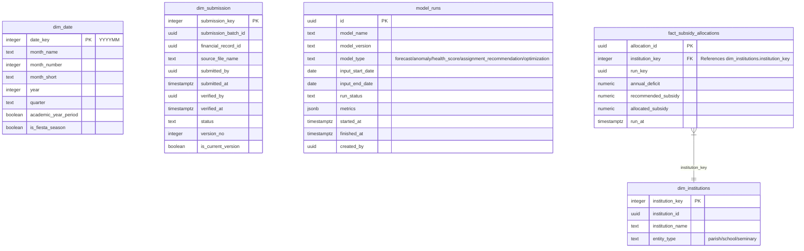

# Diocese of San Pablo - Shared Analytics Schema Diagram

This document contains the Mermaid Entity-Relationship Diagram (ERD) for the **Shared Analytics Schema**. It shows common dimensions, the model run registry, and shared analytical facts used across parish, school, seminary, and priest assignment analytics.

To view this diagram visually inside VS Code, open the **Markdown Preview** by pressing `Ctrl + Shift + V`, or click the split-pane icon in the top-right corner.

---

## 1. Shared Analytics Schema Diagram

---

## 2. Structural Breakdown

* **Core Dimensions (`dim_*`)**:
  * `dim_institutions`: Shared institution identity used by parish, school, seminary, and shared analytics.
  * `dim_date`: Shared monthly date dimension used by financial facts, model outputs, and assignment history.
  * `dim_submission`: Shared submission/version mapping for analytics records derived from uploaded or encoded reports.
* **Model Registry (`model_runs`)**: Tracks model executions for forecasting, anomaly detection, health scoring, priest assignment recommendations, and optimization.
* **Shared Facts (`fact_*`)**:
  * `fact_subsidy_allocations`: Stores subsidy optimization outputs.
* **Institution-Specific Model Outputs**: Forecasts, anomaly alerts, and health snapshots are stored in `parish_analytics`, `school_analytics`, and `seminary_analytics` so account-level outputs can reference the correct account dimension.
* **Priest Assignment Analytics**: Priest dimensions, assignment recommendations, and assignment history are stored in `priest_assignment_analytics` because that model uses parish and seminary inputs but has its own analytical purpose.

