# Diocese of San Pablo — Database Schema Specification

This document presents the **Domain-Partitioned Multi-Schema Database Architecture** for the Diocese of San Pablo Financial Analytics System. It isolates data into dedicated operational schemas based on real-world organizational domains (`diocese`, `parishes`, `schools`, `seminaries`) and centralizes model outputs under a separate `analytics` schema.

---

## 1. Domain-Partitioned Schema Map

To prevent monolithic table bloating and enforce strict domain boundaries, the database is partitioned into five PostgreSQL schemas:

```mermaid
erDiagram
    %% DIAGRAM DEFINITIONS
    
    %% DIOCESE SCHEMA
    "diocese.profiles" {
        uuid id PK
        text email
        text role
        text access_role
        text entity_id
        text entity_type
        text display_name
        text contact_number
        text status
    }
    "diocese.projects" {
        text id PK
        text name
        text description
        text fund_usage
        numeric target_amount
        numeric current_amount
        text start_date
        text end_date
        text category
        text status
        text contact_person
        numeric health_score
        numeric success_probability
        text entity_id
        text entity_type
    }
    "diocese.donations" {
        text id PK
        text project_id FK
        text donor_name
        numeric amount
        text date
        text payment_method
        boolean receipt_issued
    }
    "diocese.project_expenses" {
        text id PK
        text project_id FK
        text description
        numeric amount
        text date
        text payment_method
    }
    "diocese.announcements" {
        text id PK
        text title
        text content
        text author
        text priority
        text category
    }
    "diocese.audit_logs" {
        text id PK
        text user_name
        text user_role
        uuid user_id FK
        text category
        text severity
        text action
        text detail
    }

    %% PARISHES SCHEMA
    "parishes.details" {
        text id PK
        text name
        text vicariate
        text district
        text class
        text pastor
        text address
        text contact_number
        text email
        numeric lat
        numeric lng
        text primary_patron
        text secondary_patron
        text fiesta_date
    }
    "parishes.financial_records" {
        text id PK
        text parish_id FK
        text month
        integer year
        numeric collections
        numeric consumable_collections
        numeric disbursements
        numeric sacraments_arancel
        numeric sacraments_parish_share
        numeric sacraments_over_above
        numeric collections_mass
        numeric expenses_pastoral
        numeric expenses_parish
    }
    "parishes.fiesta_events" {
        uuid id PK
        text parish_id FK
        text primary_patron
        text date
        text expected_impact
        numeric estimated_increase
    }

    %% SCHOOLS SCHEMA
    "schools.details" {
        text id PK
        text name
        text district
        text vicariate
        text class
        text principal
        text address
        text level
        integer enrollment
        integer capacity
        integer staff
    }
    "schools.financial_records" {
        text id PK
        text school_id FK
        text month
        integer year
        numeric tuition_revenues
        numeric operational_overheads
        numeric academic_payroll
        numeric miscellaneous_fees
        numeric total_disbursements
    }

    %% SEMINARIES SCHEMA
    "seminaries.details" {
        text id PK
        text name
        text district
        text vicariate
        text class
        text rector
        text address
        integer enrollment
        integer capacity
        integer staff
    }
    "seminaries.financial_records" {
        text id PK
        text seminary_id FK
        text month
        integer year
        numeric board_and_lodging
        numeric diocesan_allocations
        numeric miscellaneous_income
        numeric house_disbursements
        numeric total_disbursements
    }

    %% ANALYTICS SCHEMA
    "analytics.financial_forecasts" {
        uuid id PK
        text entity_id
        text entity_type
        date forecast_date
        text metric_type
        text model_name
        numeric predicted_value
        numeric lower_confidence
        numeric upper_confidence
    }
    "analytics.anomaly_records" {
        uuid id PK
        text entity_id
        text entity_type
        text target_month
        integer target_year
        text metric_evaluated
        numeric anomaly_score
        boolean is_anomaly
        text severity
        text suggested_cause
    }
    "analytics.health_snapshots" {
        uuid id PK
        text entity_id
        text entity_type
        date snapshot_date
        numeric composite_score
        numeric score_liquidity
        numeric score_sustainability
        numeric score_efficiency
        numeric score_stability
        numeric score_growth
        text trend
    }
    "analytics.subsidy_optimization_results" {
        uuid id PK
        uuid run_id FK
        text entity_id
        numeric annual_deficit
        numeric recommended_subsidy
        numeric allocated_subsidy
        boolean is_locked
    }

    %% RELATIONSHIPS
    "diocese.profiles" ||--o| "parishes.details" : "manages (entity_id)"
    "diocese.profiles" ||--o| "schools.details" : "manages (entity_id)"
    "diocese.profiles" ||--o| "seminaries.details" : "manages (entity_id)"
    
    "diocese.donations" ||--|| "diocese.projects" : "funds"
    "diocese.project_expenses" ||--|| "diocese.projects" : "costed_under"
    
    "parishes.financial_records" ||--|| "parishes.details" : "belongs_to"
    "parishes.fiesta_events" ||--|| "parishes.details" : "celebrated_by"
    
    "schools.financial_records" ||--|| "schools.details" : "belongs_to"
    "seminaries.financial_records" ||--|| "seminaries.details" : "belongs_to"
    
    "analytics.subsidy_optimization_results" ||--|| "parishes.details" : "calculates_for"
```



---

## 2. Complete Data Dictionary

### A. Shared Operational Tables (schema: `diocese`)

#### `diocese.profiles`
Links user credentials with access levels and specific physical institutions.
*   `id` (UUID, Primary Key): References Supabase `auth.users(id)`.
*   `email` (TEXT): Primary contact email.
*   `role` (TEXT): System role (`bishop`, `admin`, `parish_priest`, `parish_secretary`, `school`, `seminary`, `diocese_admin`).
*   `access_role` (TEXT): Secondary UI authorization label.
*   `entity_id` (TEXT): Polymorphic ID of the institution they manage (References `parishes.details.id`, `schools.details.id`, or `seminaries.details.id`).
*   `entity_type` (TEXT): Flag (`parish`, `school`, `seminary`, `diocese`).
*   `display_name` (TEXT): User's profile moniker.
*   `contact_number` (TEXT): Telephone or mobile number.
*   `status` (TEXT): Account status (`active`, `inactive`, `archived`).

#### `diocese.projects`
Diocesan-wide or institution-specific developmental capital projects.
*   `id` (TEXT, Primary Key): Sequence-generated string (e.g., `PRJ-001`).
*   `name` (TEXT): Project title.
*   `description` (TEXT): Descriptive overview.
*   `fund_usage` (TEXT): Scope of project financing.
*   `target_amount` (NUMERIC): Target budget.
*   `current_amount` (NUMERIC): Accumulated funds.
*   `start_date` (TEXT), `end_date` (TEXT): Operational timeline bounds.
*   `category` (TEXT): Project classification.
*   `status` (TEXT): Project state (`active`, `completed`, `on-hold`).
*   `health_score` (NUMERIC), `success_probability` (NUMERIC): ML evaluations.
*   `entity_id` (TEXT), `entity_type` (TEXT): Owner institution.

#### `diocese.donations`
*   `id` (TEXT, Primary Key): Reference string (e.g., `DON-00001`).
*   `project_id` (TEXT, Foreign Key): References `diocese.projects(id)`.
*   `donor_name` (TEXT): Name of donor.
*   `amount` (NUMERIC): Amount donated.
*   `payment_method` (TEXT): Transaction type (`Cash`, `Check`, `Online`, `Bank Transfer`).
*   `receipt_issued` (BOOLEAN): Status of audited receipt.

#### `diocese.project_expenses`
*   `id` (TEXT, Primary Key): Sequence identifier (e.g., `EXP-00001`).
*   `project_id` (TEXT, Foreign Key): References `diocese.projects(id)`.
*   `description` (TEXT): Itemized description of transaction.
*   `amount` (NUMERIC): Total disbursement cost.
*   `payment_method` (TEXT): Method of payment.

---

### B. Parish Operational Tables (schema: `parishes`)

#### `parishes.details`
Holds parish geographic boundaries, classifications, and fixtures.
*   `id` (TEXT, Primary Key): Sequence identifier (e.g., `PAR-001`).
*   `name` (TEXT): Official parish name.
*   `vicariate` (TEXT), `district` (TEXT): Diocesan geographic grouping.
*   `class` (TEXT): Parish financial tier (`Class A` to `Class E`).
*   `pastor` (TEXT): Assigned parish priest.
*   `lat` (NUMERIC), `lng` (NUMERIC): Geographic coordinates.
*   `primary_patron` (TEXT), `secondary_patron` (TEXT): Saints details.
*   `fiesta_date` (TEXT): Main celebration date.

#### `parishes.financial_records`
Specific parochial transactional categories (mass collections, sacraments, pastoral expenses).
*   `id` (TEXT, Primary Key): Rollup sequence key (e.g., `FIN-000001`).
*   `parish_id` (TEXT, Foreign Key): References `parishes.details(id)`.
*   `month` (TEXT), `year` (INTEGER): Time parameters.
*   `collections` (NUMERIC): General parish income.
*   `consumable_collections` (NUMERIC): Retained parish earnings.
*   `disbursements` (NUMERIC): Total operational spend.
*   `sacraments_arancel` (NUMERIC): Revenue from official sacramental rates.
*   `sacraments_parish_share` (NUMERIC): Retained parish portion.
*   `sacraments_over_above` (NUMERIC): Voluntary additional parish offerings.
*   `collections_mass` (NUMERIC): Income from standard holy mass collection bags.
*   `expenses_pastoral` (NUMERIC): Cost of parochial community work.
*   `expenses_parish` (NUMERIC): Building and utilities overhead.

#### `parishes.fiesta_events`
Tracks parochial fiesta plans and estimating collection spikes.
*   `id` (UUID, Primary Key): Random UUID.
*   `parish_id` (TEXT, Foreign Key): References `parishes.details(id)`.
*   `primary_patron` (TEXT): Saint celebrated.
*   `date` (TEXT): Date of celebration.
*   `expected_impact` (TEXT): Expected financial collection tier (`low`, `medium`, `high`).
*   `estimated_increase` (NUMERIC): Estimated collection increase amount.

---

### C. School Operational Tables (schema: `schools`)

#### `schools.details`
*   `id` (TEXT, Primary Key): Code string (e.g., `SCH-001`).
*   `name` (TEXT): Official educational academy name.
*   `principal` (TEXT): Head principal.
*   `level` (TEXT): Educational scope (e.g., `K-12`, `Junior High`).
*   `enrollment` (INTEGER), `capacity` (INTEGER): Pupil statistics.
*   `staff` (INTEGER): Academic and security staff counts.

#### `schools.financial_records`
Academic specific accounting parameters (tuition collections, payroll overhead).
*   `id` (TEXT, Primary Key): Reference string.
*   `school_id` (TEXT, Foreign Key): References `schools.details(id)`.
*   `month` (TEXT), `year` (INTEGER): Reporting period.
*   `tuition_revenues` (NUMERIC): Student tuition collections.
*   `operational_overheads` (NUMERIC): Utilities, labs, maintenance.
*   `academic_payroll` (NUMERIC): Teacher and staff salaries.
*   `miscellaneous_fees` (NUMERIC): Labs, library, athletic fees.
*   `total_disbursements` (NUMERIC): Net operational spending.

---

### D. Seminary Operational Tables (schema: `seminaries`)

#### `seminaries.details`
*   `id` (TEXT, Primary Key): Code string (e.g., `SEM-001`).
*   `name` (TEXT): Seminary formation house name.
*   `rector` (TEXT): Assigned rector priest.
*   `enrollment` (INTEGER), `capacity` (INTEGER): Seminarian headcount.

#### `seminaries.financial_records`
Format and board accounting categories.
*   `id` (TEXT, Primary Key): Reference string.
*   `seminary_id` (TEXT, Foreign Key): References `seminaries.details(id)`.
*   `month` (TEXT), `year` (INTEGER): Reporting period.
*   `board_and_lodging` (NUMERIC): Seminarian monthly boarding fees.
*   `diocesan_allocations` (NUMERIC): Operational subsidies from the Bishop's Curia.
*   `miscellaneous_income` (NUMERIC): Individual sponsor offerings.
*   `house_disbursements` (NUMERIC): Food, utility, and maintenance spending.

---

### E. Analytical / ML Tables (schema: `analytics`)

#### `analytics.financial_forecasts`
Future predictions generated by Prophet or SARIMA engines.
*   `id` (UUID, Primary Key): Random identifier.
*   `entity_id` (TEXT), `entity_type` (TEXT): Polymorphic reference to institution.
*   `forecast_date` (DATE): Forecast target date.
*   `metric_type` (TEXT): Predicted category (`collections`, `disbursements`).
*   `model_name` (TEXT): Engine model (`Prophet`, `SARIMA`).
*   `predicted_value` (NUMERIC): Prediced target value ($yhat$).
*   `lower_confidence` (NUMERIC), `upper_confidence` (NUMERIC): Confidence margin bounds ($yhat\_lower$ / $yhat\_upper$).

#### `analytics.anomaly_records`
Flagged anomalies from isolation forest operations.
*   `id` (UUID, Primary Key): Random identifier.
*   `entity_id` (TEXT), `entity_type` (TEXT): Target institution polymorphic ID.
*   `target_month` (TEXT), `target_year` (INTEGER): Date target.
*   `metric_evaluated` (TEXT): Evaluation target.
*   `anomaly_score` (NUMERIC): ML distance score.
*   `is_anomaly` (BOOLEAN): Status flag.
*   `severity` (TEXT): Severity classification (`info`, `warning`, `critical`).
*   `suggested_cause` (TEXT): AI diagnostic assessment of potential root cause.

#### `analytics.health_snapshots`
Multi-dimensional financial index metrics calculated per entity.
*   `id` (UUID, Primary Key): Snap identifier.
*   `entity_id` (TEXT), `entity_type` (TEXT): Target institution polymorph ID.
*   `snapshot_date` (DATE): Audit evaluation date.
*   `composite_score` (NUMERIC): Core score index (0-100).
*   `score_liquidity` (NUMERIC), `score_sustainability` (NUMERIC), `score_efficiency` (NUMERIC), `score_stability` (NUMERIC), `score_growth` (NUMERIC): Dimension metrics.
*   `trend` (TEXT): Movement (`up`, `down`, `stable`).

#### `analytics.subsidy_optimization_results`
Linear Programming outputs determining the matching of parochial deficits against global curia budgets.
*   `id` (UUID, Primary Key): Result identifier.
*   `run_id` (UUID): Reference to optimizer execution run metadata.
*   `entity_id` (TEXT): Target parish.
*   `annual_deficit` (NUMERIC): Discovered funding gap ($2M - collections$).
*   `recommended_subsidy` (NUMERIC): Recommended subsidy allocation from LP solver.
*   `allocated_subsidy` (NUMERIC): Final approved subsidy.
*   `is_locked` (BOOLEAN): Lock flag to freeze variables against dynamic recalculation.

---

## 3. SQL DDL Script (PostgreSQL/Supabase)

```sql
-- =============================================================================
-- DIOCESE OF SAN PABLO — DATABASE DDL (DOMAIN-PARTITIONED MULTI-SCHEMA)
-- =============================================================================

CREATE EXTENSION IF NOT EXISTS "pgcrypto";

-- CREATE SCHEMAS
CREATE SCHEMA IF NOT EXISTS diocese;
CREATE SCHEMA IF NOT EXISTS parishes;
CREATE SCHEMA IF NOT EXISTS schools;
CREATE SCHEMA IF NOT EXISTS seminaries;
CREATE SCHEMA IF NOT EXISTS analytics;

-- HELPER: Sequence DDL format generator
CREATE OR REPLACE FUNCTION public.format_seq_id(prefix TEXT, seq_name TEXT, min_digits INT DEFAULT 5)
RETURNS TEXT AS $$
DECLARE
  val BIGINT;
BEGIN
  val := nextval(seq_name);
  RETURN prefix || lpad(val::text, GREATEST(min_digits, length(val::text))::int, '0');
END;
$$ LANGUAGE plpgsql SECURITY DEFINER;

-- =============================================================================
-- A. DIOCESE SCHEMA
-- =============================================================================

CREATE TABLE IF NOT EXISTS diocese.profiles (
  id              UUID        PRIMARY KEY REFERENCES auth.users(id) ON DELETE CASCADE,
  email           TEXT,
  role            TEXT        NOT NULL DEFAULT 'parish_priest'
    CHECK (role IN ('bishop', 'admin', 'parish_priest', 'parish_secretary', 'school', 'seminary', 'diocese_admin')),
  access_role     TEXT,
  entity_id       TEXT,
  entity_type     TEXT        CHECK (entity_type IN ('parish', 'school', 'seminary', 'diocese')),
  display_name    TEXT,
  contact_number  TEXT,
  status          TEXT        NOT NULL DEFAULT 'active' CHECK (status IN ('active', 'inactive', 'archived')),
  created_at      TIMESTAMPTZ NOT NULL DEFAULT NOW()
);

CREATE SEQUENCE IF NOT EXISTS diocese.projects_seq START 1;

CREATE TABLE IF NOT EXISTS diocese.projects (
  id                   TEXT        PRIMARY KEY DEFAULT public.format_seq_id('PRJ-', 'diocese.projects_seq', 3),
  name                 TEXT        NOT NULL,
  description          TEXT,
  fund_usage           TEXT,
  target_amount        NUMERIC     NOT NULL DEFAULT 0,
  current_amount       NUMERIC     NOT NULL DEFAULT 0,
  start_date           TEXT,
  end_date             TEXT,
  category             TEXT,
  status               TEXT        NOT NULL DEFAULT 'active' CHECK (status IN ('active', 'completed', 'on-hold')),
  contact_person       TEXT,
  health_score         NUMERIC     DEFAULT 0,
  success_probability  NUMERIC     DEFAULT 0,
  recommendation       TEXT,
  entity_id            TEXT        NOT NULL,
  entity_type          TEXT        NOT NULL CHECK (entity_type IN ('parish', 'school', 'seminary', 'diocese')),
  created_at           TIMESTAMPTZ NOT NULL DEFAULT NOW()
);

CREATE SEQUENCE IF NOT EXISTS diocese.donations_seq START 1;

CREATE TABLE IF NOT EXISTS diocese.donations (
  id                  TEXT        PRIMARY KEY DEFAULT public.format_seq_id('DON-', 'diocese.donations_seq', 5),
  project_id          TEXT        NOT NULL REFERENCES diocese.projects(id) ON DELETE CASCADE,
  donor_name          TEXT,
  amount              NUMERIC     NOT NULL DEFAULT 0,
  date                TEXT,
  payment_method      TEXT        CHECK (payment_method IN ('Cash', 'Check', 'Online', 'Bank Transfer')),
  receipt_issued      BOOLEAN     DEFAULT false,
  created_at          TIMESTAMPTZ NOT NULL DEFAULT NOW()
);

CREATE SEQUENCE IF NOT EXISTS diocese.expenses_seq START 1;

CREATE TABLE IF NOT EXISTS diocese.project_expenses (
  id                  TEXT        PRIMARY KEY DEFAULT public.format_seq_id('EXP-', 'diocese.expenses_seq', 5),
  project_id          TEXT        NOT NULL REFERENCES diocese.projects(id) ON DELETE CASCADE,
  description         TEXT        NOT NULL,
  amount              NUMERIC     NOT NULL DEFAULT 0,
  date                TEXT,
  payment_method      TEXT        CHECK (payment_method IN ('Cash', 'Check', 'Online', 'Bank Transfer')),
  created_at          TIMESTAMPTZ NOT NULL DEFAULT NOW()
);

CREATE SEQUENCE IF NOT EXISTS diocese.announcements_seq START 1;

CREATE TABLE IF NOT EXISTS diocese.announcements (
  id           TEXT        PRIMARY KEY DEFAULT public.format_seq_id('ANC-', 'diocese.announcements_seq', 3),
  title        TEXT        NOT NULL,
  content      TEXT        NOT NULL,
  author       TEXT        NOT NULL,
  priority     TEXT        NOT NULL DEFAULT 'medium' CHECK (priority IN ('low', 'medium', 'high')),
  category     TEXT        NOT NULL DEFAULT 'general' CHECK (category IN ('general', 'financial', 'administrative', 'event')),
  created_at   TIMESTAMPTZ NOT NULL DEFAULT NOW()
);

CREATE SEQUENCE IF NOT EXISTS diocese.audit_logs_seq START 1;

CREATE TABLE IF NOT EXISTS diocese.audit_logs (
  id          TEXT        PRIMARY KEY DEFAULT public.format_seq_id('LOG-', 'diocese.audit_logs_seq', 5),
  user_name   TEXT        NOT NULL,
  user_role   TEXT        NOT NULL,
  user_id     UUID        REFERENCES diocese.profiles(id) ON DELETE SET NULL,
  category    TEXT        NOT NULL CHECK (category IN ('auth', 'finance', 'analytics', 'reports', 'system')),
  severity    TEXT        NOT NULL DEFAULT 'info' CHECK (severity IN ('info', 'warning', 'error', 'success')),
  action      TEXT        NOT NULL,
  detail      TEXT        NOT NULL,
  created_at  TIMESTAMPTZ NOT NULL DEFAULT NOW()
);

-- =============================================================================
-- B. PARISHES SCHEMA
-- =============================================================================

CREATE SEQUENCE IF NOT EXISTS parishes.details_seq START 1;

CREATE TABLE IF NOT EXISTS parishes.details (
  id               TEXT        PRIMARY KEY DEFAULT public.format_seq_id('PAR-', 'parishes.details_seq', 3),
  name             TEXT        NOT NULL,
  vicariate        TEXT        NOT NULL,
  district         TEXT,
  class            TEXT        NOT NULL DEFAULT 'Class C' CHECK (class IN ('Class A', 'Class B', 'Class C', 'Class D', 'Class E')),
  pastor           TEXT        NOT NULL DEFAULT 'Not assigned',
  address          TEXT        DEFAULT '',
  contact_number   TEXT        DEFAULT '',
  email            TEXT        DEFAULT '',
  lat              NUMERIC,
  lng              NUMERIC,
  primary_patron   TEXT,
  secondary_patron TEXT,
  fiesta_date      TEXT,
  created_at       TIMESTAMPTZ NOT NULL DEFAULT NOW()
);

CREATE SEQUENCE IF NOT EXISTS parishes.finance_seq START 1;

CREATE TABLE IF NOT EXISTS parishes.financial_records (
  id                                      TEXT        PRIMARY KEY DEFAULT public.format_seq_id('FIN-', 'parishes.finance_seq', 6),
  parish_id                               TEXT        NOT NULL REFERENCES parishes.details(id) ON DELETE CASCADE,
  month                                   TEXT        NOT NULL,
  year                                    INTEGER     NOT NULL,
  collections                             NUMERIC     NOT NULL DEFAULT 0,
  consumable_collections                  NUMERIC     NOT NULL DEFAULT 0,
  disbursements                           NUMERIC     NOT NULL DEFAULT 0,
  sacraments_arancel                      NUMERIC     DEFAULT 0,
  sacraments_parish_share                 NUMERIC     DEFAULT 0,
  sacraments_over_above                   NUMERIC     DEFAULT 0,
  collections_mass                        NUMERIC     DEFAULT 0,
  expenses_pastoral                       NUMERIC     DEFAULT 0,
  expenses_parish                         NUMERIC     DEFAULT 0,
  created_at                              TIMESTAMPTZ NOT NULL DEFAULT NOW()
);

CREATE TABLE IF NOT EXISTS parishes.fiesta_events (
  id                  UUID        PRIMARY KEY DEFAULT gen_random_uuid(),
  parish_id           TEXT        NOT NULL REFERENCES parishes.details(id) ON DELETE CASCADE,
  primary_patron      TEXT        NOT NULL,
  date                TEXT        NOT NULL,
  expected_impact     TEXT        NOT NULL CHECK (expected_impact IN ('low', 'medium', 'high')),
  estimated_increase  NUMERIC     DEFAULT 0,
  created_at          TIMESTAMPTZ NOT NULL DEFAULT NOW()
);

-- =============================================================================
-- C. SCHOOLS SCHEMA
-- =============================================================================

CREATE SEQUENCE IF NOT EXISTS schools.details_seq START 1;

CREATE TABLE IF NOT EXISTS schools.details (
  id           TEXT        PRIMARY KEY DEFAULT public.format_seq_id('SCH-', 'schools.details_seq', 3),
  name         TEXT        NOT NULL,
  district     TEXT,
  vicariate    TEXT        NOT NULL,
  class        TEXT        NOT NULL DEFAULT 'Class C' CHECK (class IN ('Class A', 'Class B', 'Class C', 'Class D', 'Class E')),
  principal    TEXT        NOT NULL DEFAULT 'Not assigned',
  address      TEXT        DEFAULT '',
  level        TEXT        NOT NULL DEFAULT 'K-12',
  enrollment   INTEGER     NOT NULL DEFAULT 0,
  capacity     INTEGER     NOT NULL DEFAULT 0,
  staff        INTEGER     NOT NULL DEFAULT 0,
  created_at   TIMESTAMPTZ NOT NULL DEFAULT NOW()
);

CREATE SEQUENCE IF NOT EXISTS schools.finance_seq START 1;

CREATE TABLE IF NOT EXISTS schools.financial_records (
  id                  TEXT        PRIMARY KEY DEFAULT public.format_seq_id('FSCH-', 'schools.finance_seq', 6),
  school_id           TEXT        NOT NULL REFERENCES schools.details(id) ON DELETE CASCADE,
  month               TEXT        NOT NULL,
  year                INTEGER     NOT NULL,
  tuition_revenues    NUMERIC     NOT NULL DEFAULT 0,
  operational_overheads NUMERIC   NOT NULL DEFAULT 0,
  academic_payroll    NUMERIC     NOT NULL DEFAULT 0,
  miscellaneous_fees  NUMERIC     NOT NULL DEFAULT 0,
  total_disbursements NUMERIC     NOT NULL DEFAULT 0,
  created_at          TIMESTAMPTZ NOT NULL DEFAULT NOW()
);

-- =============================================================================
-- D. SEMINARIES SCHEMA
-- =============================================================================

CREATE SEQUENCE IF NOT EXISTS seminaries.details_seq START 1;

CREATE TABLE IF NOT EXISTS seminaries.details (
  id           TEXT        PRIMARY KEY DEFAULT public.format_seq_id('SEM-', 'seminaries.details_seq', 3),
  name         TEXT        NOT NULL,
  district     TEXT,
  vicariate    TEXT        NOT NULL,
  class        TEXT        NOT NULL DEFAULT 'Class C' CHECK (class IN ('Class A', 'Class B', 'Class C', 'Class D', 'Class E')),
  rector       TEXT        NOT NULL DEFAULT 'Not assigned',
  address      DEFAULT '',
  enrollment   INTEGER     NOT NULL DEFAULT 0,
  capacity     INTEGER     NOT NULL DEFAULT 0,
  staff        INTEGER     NOT NULL DEFAULT 0,
  created_at   TIMESTAMPTZ NOT NULL DEFAULT NOW()
);

CREATE SEQUENCE IF NOT EXISTS seminaries.finance_seq START 1;

CREATE TABLE IF NOT EXISTS seminaries.financial_records (
  id                  TEXT        PRIMARY KEY DEFAULT public.format_seq_id('FSEM-', 'seminaries.finance_seq', 6),
  seminary_id         TEXT        NOT NULL REFERENCES seminaries.details(id) ON DELETE CASCADE,
  month               TEXT        NOT NULL,
  year                INTEGER     NOT NULL,
  board_and_lodging   NUMERIC     NOT NULL DEFAULT 0,
  diocesan_allocations NUMERIC    NOT NULL DEFAULT 0,
  miscellaneous_income NUMERIC    NOT NULL DEFAULT 0,
  house_disbursements NUMERIC     NOT NULL DEFAULT 0,
  total_disbursements NUMERIC     NOT NULL DEFAULT 0,
  created_at          TIMESTAMPTZ NOT NULL DEFAULT NOW()
);

-- =============================================================================
-- E. ANALYTICS SCHEMA
-- =============================================================================

CREATE TABLE IF NOT EXISTS analytics.financial_forecasts (
  id                  UUID        PRIMARY KEY DEFAULT gen_random_uuid(),
  entity_id           TEXT        NOT NULL,
  entity_type         TEXT        NOT NULL CHECK (entity_type IN ('parish', 'school', 'seminary')),
  forecast_date       DATE        NOT NULL,
  metric_type         TEXT        NOT NULL CHECK (metric_type IN ('collections', 'disbursements')),
  model_name          TEXT        NOT NULL DEFAULT 'Prophet',
  predicted_value     NUMERIC     NOT NULL,
  lower_confidence    NUMERIC     NOT NULL,
  upper_confidence    NUMERIC     NOT NULL,
  run_timestamp       TIMESTAMPTZ NOT NULL DEFAULT NOW()
);

CREATE TABLE IF NOT EXISTS analytics.anomaly_records (
  id                  UUID        PRIMARY KEY DEFAULT gen_random_uuid(),
  entity_id           TEXT        NOT NULL,
  entity_type         TEXT        NOT NULL CHECK (entity_type IN ('parish', 'school', 'seminary')),
  target_month        TEXT        NOT NULL,
  target_year         INTEGER     NOT NULL,
  metric_evaluated    TEXT        NOT NULL CHECK (metric_evaluated IN ('collections', 'disbursements')),
  anomaly_score       NUMERIC     NOT NULL,
  is_anomaly          BOOLEAN     NOT NULL DEFAULT false,
  severity            TEXT        NOT NULL DEFAULT 'info' CHECK (severity IN ('info', 'warning', 'critical')),
  suggested_cause     TEXT,
  created_at          TIMESTAMPTZ NOT NULL DEFAULT NOW()
);

CREATE TABLE IF NOT EXISTS analytics.health_snapshots (
  id                  UUID        PRIMARY KEY DEFAULT gen_random_uuid(),
  entity_id           TEXT        NOT NULL,
  entity_type         TEXT        NOT NULL CHECK (entity_type IN ('parish', 'school', 'seminary')),
  snapshot_date       DATE        NOT NULL DEFAULT CURRENT_DATE,
  composite_score     NUMERIC     NOT NULL CHECK (composite_score BETWEEN 0 AND 100),
  score_liquidity     NUMERIC     NOT NULL CHECK (score_liquidity BETWEEN 0 AND 100),
  score_sustainability NUMERIC    NOT NULL CHECK (score_sustainability BETWEEN 0 AND 100),
  score_efficiency    NUMERIC     NOT NULL CHECK (score_efficiency BETWEEN 0 AND 100),
  score_stability     NUMERIC     NOT NULL CHECK (score_stability BETWEEN 0 AND 100),
  score_growth        NUMERIC     NOT NULL CHECK (score_growth BETWEEN 0 AND 100),
  trend               TEXT        NOT NULL DEFAULT 'stable' CHECK (trend IN ('up', 'down', 'stable')),
  created_at          TIMESTAMPTZ NOT NULL DEFAULT NOW()
);

CREATE TABLE IF NOT EXISTS analytics.subsidy_optimization_runs (
  id                  UUID        PRIMARY KEY DEFAULT gen_random_uuid(),
  total_budget_pool   NUMERIC     NOT NULL,
  run_date            TIMESTAMPTZ NOT NULL DEFAULT NOW(),
  status              TEXT        NOT NULL DEFAULT 'proposed' CHECK (status IN ('proposed', 'approved'))
);

CREATE TABLE IF NOT EXISTS analytics.subsidy_optimization_results (
  id                  UUID        PRIMARY KEY DEFAULT gen_random_uuid(),
  run_id              UUID        NOT NULL REFERENCES analytics.subsidy_optimization_runs(id) ON DELETE CASCADE,
  entity_id           TEXT        NOT NULL REFERENCES parishes.details(id) ON DELETE CASCADE,
  annual_deficit      NUMERIC     NOT NULL DEFAULT 0,
  recommended_subsidy NUMERIC     NOT NULL DEFAULT 0,
  allocated_subsidy   NUMERIC     NOT NULL DEFAULT 0,
  is_locked           BOOLEAN     NOT NULL DEFAULT false,
  created_at          TIMESTAMPTZ NOT NULL DEFAULT NOW()
);

-- =============================================================================
-- PERFORMANCE INDEXES & POLICIES
-- =============================================================================

CREATE INDEX IF NOT EXISTS idx_parish_financial_period ON parishes.financial_records (parish_id, year, month);
CREATE INDEX IF NOT EXISTS idx_school_financial_period ON schools.financial_records (school_id, year, month);
CREATE INDEX IF NOT EXISTS idx_seminary_financial_period ON seminaries.financial_records (seminary_id, year, month);

CREATE INDEX IF NOT EXISTS idx_forecasts_lookup ON analytics.financial_forecasts (entity_id, forecast_date);
CREATE INDEX IF NOT EXISTS idx_anomalies_lookup ON analytics.anomaly_records (entity_id, is_anomaly);
CREATE INDEX IF NOT EXISTS idx_health_lookup ON analytics.health_snapshots (entity_id, snapshot_date DESC);
