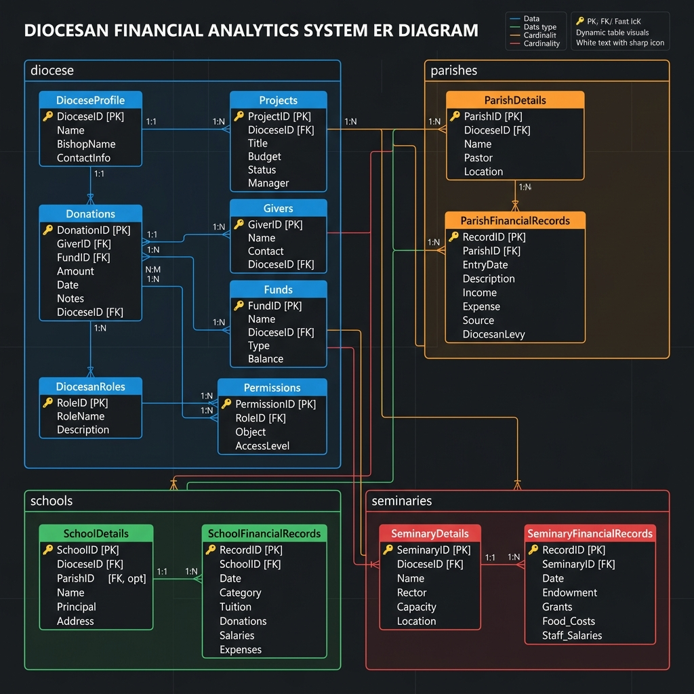
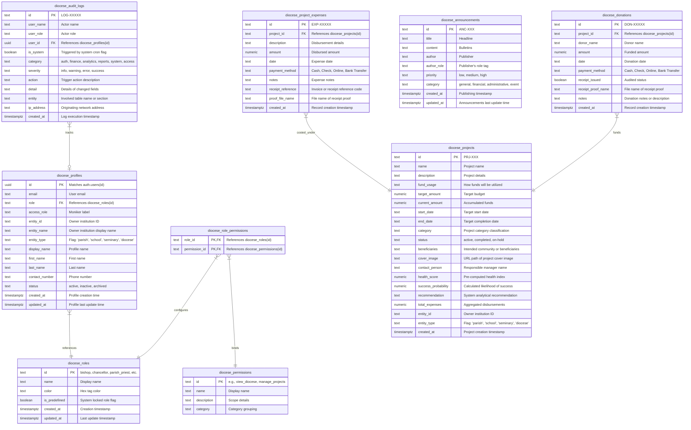
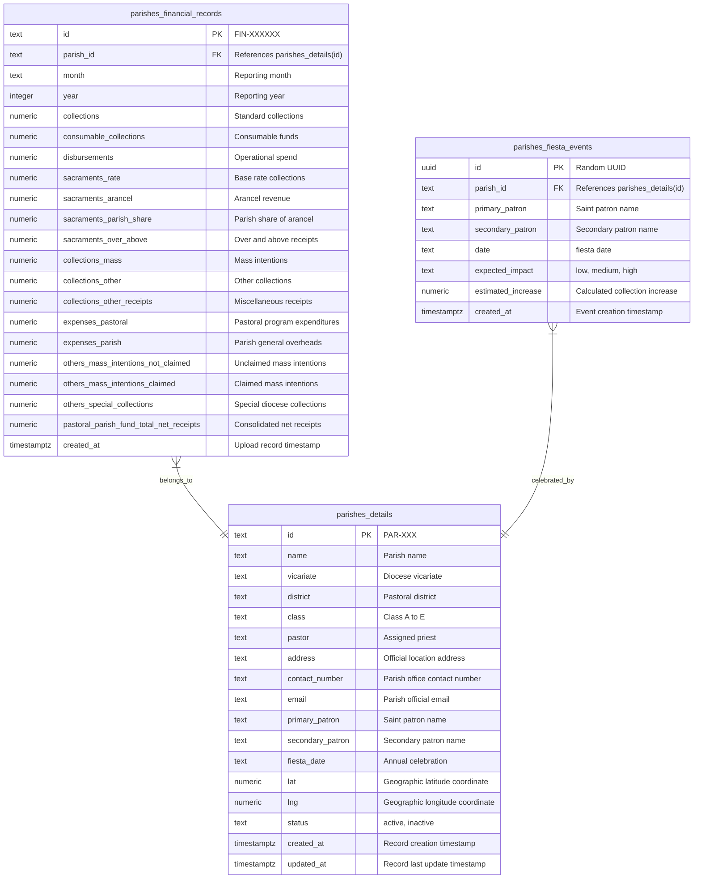
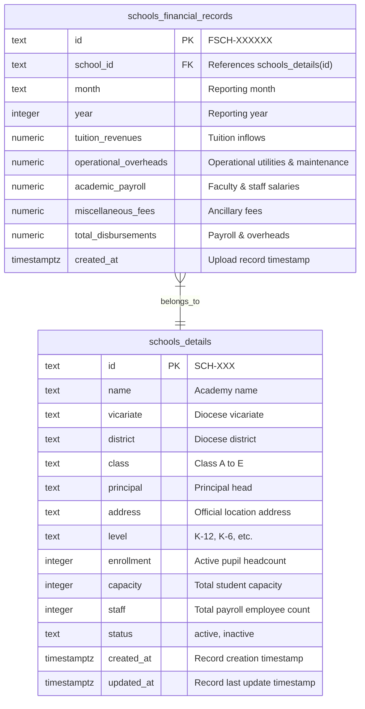
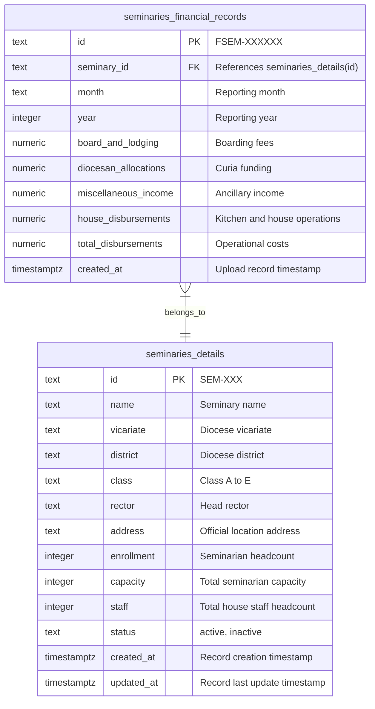
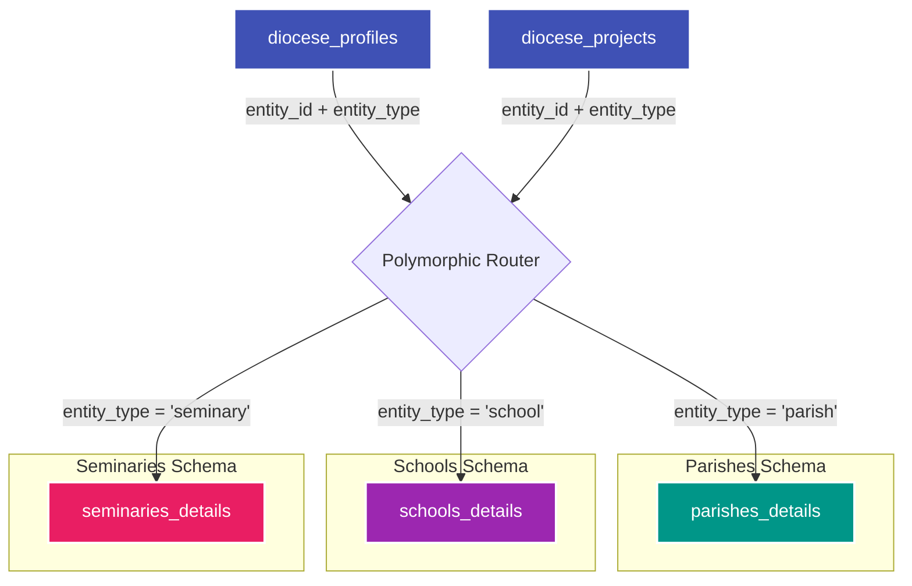

# Diocese of San Pablo — Operational Database Specification (v5.2)

### Operational Database ER Diagram (Visual Blueprint)
To view the full visual relational diagram as a graphic, open the **`database_schema_erd.png`** file directly in your VS Code File Explorer sidebar on the left.



---

This specification details the **Operational Database (OLTP) Architecture** for the Diocese of San Pablo Financial Analytics System. It isolates transactional records into dedicated operational schemas based on real-world organizational domains (`diocese`, `parishes`, `schools`, `seminaries`).

Analytical tables and views are excluded from this specification to focus strictly on operational transactions.

---

## 1. Operational Database Schema Diagrams

To make the database architecture easy to digest, it is broken down into two parts:
1. **Isolated Domain Schemas**: Individual Mermaid ERDs showing exactly how each schema is structured. All entity names have been updated to use standard Mermaid ERD identifier syntax (`diocese_roles`, `parishes_details`, etc.) to ensure reliable rendering in standard markdown readers.
2. **Global Connections Diagram**: A consolidated Mermaid ERD showing how all four schemas link to each other, highlighting both database-enforced foreign keys and virtual polymorphic links.

---

### A. Isolated Domain Schemas (Mermaid Diagrams)

#### 1. Core & Administration Schema (`diocese`)
*Manages authentication (profiles), user access control (RBAC), announcements, audit logs, and global projects.*



#### 2. Parishes Schema (`parishes`)
*Contains parish details, annual fiesta schedules, and parochial monthly account ledgers.*



#### 3. Schools Schema (`schools`)
*Manages school profiles, student capacities, and academic overhead accounting.*



#### 4. Seminaries Schema (`seminaries`)
*Tracks seminary rector profiles, enrollment, and boarding accounts.*



---

### B. Explanation of the Core `diocese` Schema Connections

The `diocese` schema operates as the relational backbone of the entire database. It can be understood through three clear database patterns:

1. **The Role-Based Access Control (RBAC) Flow**:
   * `diocese_profiles` (user accounts) has a foreign key `role` referencing `diocese_roles`.
   * `diocese_roles` has a many-to-many relationship with `diocese_permissions` managed by the join table `diocese_role_permissions`.
   * **In practice**: When a user logs in, the backend joins `diocese_profiles` $\rightarrow$ `diocese_roles` $\rightarrow$ `diocese_role_permissions` $\rightarrow$ `diocese_permissions` to discover exactly what actions (like `manage_projects` or `digital_twin`) that user is authorized to perform.
2. **The Polymorphic Institution Link**:
   * A user profile (`diocese_profiles`) or a project (`diocese_projects`) is not linked to institutions via three separate nullable columns (which would create bad database design).
   * Instead, they use a **polymorphic pair**: **`entity_id`** (storing the ID of the parish, school, or seminary) and **`entity_type`** (storing `'parish'`, `'school'`, `'seminary'`, or `'diocese'`).
   * **In practice**: Since database engines do not support native foreign key constraints across multiple tables using a single column, this link is **virtually enforced** at the application or service layer (and through PostgreSQL check constraints and triggers).
3. **The Capital Projects Ledger**:
   * The `diocese_projects` table tracks structural developments.
   * `diocese_donations` and `diocese_project_expenses` are linked strictly to a parent project via `project_id` foreign keys. This allows the system to sum donations and subtract expenses to compute real-time project cash balances.

#### Visualizing the Polymorphic Association

Below is a flow diagram that represents how the polymorphic router dynamically maps a single `entity_id` field to the appropriate details table based on the value stored in the `entity_type` column:



#### How to Query the Polymorphic Link (SQL Examples)

Because there are no hard foreign keys on polymorphic columns, queries require conditional joins or queries.

*   **Example A: Dynamic Subqueries (To retrieve entity display name on user profile selection)**:
    ```sql
    SELECT 
      p.id AS profile_id,
      p.email,
      p.role,
      p.entity_type,
      p.entity_id,
      CASE p.entity_type
        WHEN 'parish' THEN (SELECT name FROM parishes.details WHERE id = p.entity_id)
        WHEN 'school' THEN (SELECT name FROM schools.details WHERE id = p.entity_id)
        WHEN 'seminary' THEN (SELECT name FROM seminaries.details WHERE id = p.entity_id)
        ELSE 'Diocesan Administration'
      END AS entity_name
    FROM diocese.profiles p;
    ```

*   **Example B: Conditional LEFT JOINs (To fetch projects with their owning institutional data)**:
    ```sql
    SELECT 
      pr.id AS project_id,
      pr.name AS project_name,
      pr.target_amount,
      pr.entity_type,
      COALESCE(pa.name, sc.name, se.name) AS owner_name
    FROM diocese.projects pr
    LEFT JOIN parishes.details pa ON pr.entity_type = 'parish' AND pr.entity_id = pa.id
    LEFT JOIN schools.details sc ON pr.entity_type = 'school' AND pr.entity_id = sc.id
    LEFT JOIN seminaries.details se ON pr.entity_type = 'seminary' AND pr.entity_id = se.id;
    ```

---

### C. Global Schema Connections (All Relations Map)

This combined schema map displays how all four partitioned schemas connect with each other, showing user access boundaries and institutional polymorphic links:

```mermaid
erDiagram
    %% =========================================================================
    %% DIOCESE SCHEMA (Operational Core & RBAC)
    %% =========================================================================
    diocese_roles {
        text id PK
        text name
        text color
    }
    diocese_permissions {
        text id PK
        text name
    }
    diocese_role_permissions {
        text role_id PK, FK
        text permission_id PK, FK
    }
    diocese_profiles {
        uuid id PK
        text email
        text role FK
        text entity_id
        text entity_type
    }
    diocese_projects {
        text id PK
        text name
        text entity_id
        text entity_type
    }
    diocese_donations {
        text id PK
        text project_id FK
        numeric amount
    }
    diocese_project_expenses {
        text id PK
        text project_id FK
        numeric amount
    }

    %% =========================================================================
    %% PARISHES SCHEMA (Parish Domain)
    %% =========================================================================
    parishes_details {
        text id PK
        text name
        text vicariate
    }
    parishes_financial_records {
        text id PK
        text parish_id FK
        numeric collections
        numeric disbursements
    }
    parishes_fiesta_events {
        uuid id PK
        text parish_id FK
        text primary_patron
    }

    %% =========================================================================
    %% SCHOOLS SCHEMA (School Domain)
    %% =========================================================================
    schools_details {
        text id PK
        text name
        text vicariate
    }
    schools_financial_records {
        text id PK
        text school_id FK
        numeric tuition_revenues
        numeric total_disbursements
    }

    %% =========================================================================
    %% SEMINARIES SCHEMA (Seminary Domain)
    %% =========================================================================
    seminaries_details {
        text id PK
        text name
        text vicariate
    }
    seminaries_financial_records {
        text id PK
        text seminary_id FK
        numeric board_and_lodging
        numeric total_disbursements
    }

    %% RELATIONSHIPS
    diocese_profiles ||--o| diocese_roles : "references"
    diocese_role_permissions ||--|| diocese_roles : "configures"
    diocese_role_permissions ||--|| diocese_permissions : "binds"
    
    %% Polymorphic Links (Virtual Relationships represented visually)
    diocese_profiles ||--o| parishes_details : "manages (entity_id, entity_type='parish')"
    diocese_profiles ||--o| schools_details : "manages (entity_id, entity_type='school')"
    diocese_profiles ||--o| seminaries_details : "manages (entity_id, entity_type='seminary')"

    diocese_projects ||--o| parishes_details : "owned_by (entity_id, entity_type='parish')"
    diocese_projects ||--o| schools_details : "owned_by (entity_id, entity_type='school')"
    diocese_projects ||--o| seminaries_details : "owned_by (entity_id, entity_type='seminary')"
    
    diocese_donations ||--|| diocese_projects : "funds"
    diocese_project_expenses ||--|| diocese_projects : "costed_under"
    
    parishes_financial_records ||--|| parishes_details : "belongs_to"
    parishes_fiesta_events ||--|| parishes_details : "celebrated_by"
    
    schools_financial_records ||--|| schools_details : "belongs_to"
    seminaries_financial_records ||--|| seminaries_details : "belongs_to"
```



---

## 2. Operational Data Dictionary

### A. Shared Operational Schema (`diocese`)

#### Table: `diocese.roles`
Stores role definitions for role-based authorization scopes.
*   `id` (TEXT, Primary Key): Unique string identifier for the system role (`bishop`, `chancellor`, `diocesan_oeconomus`, `finance_staff`, `parish_priest`, `parish_secretary`, `seminary_rector`, `seminary_oeconomus`, `school_superintendent`, `finance_supervisor`, `finance_officer`, `school_principal`).
*   `name` (TEXT): Display moniker for the UI (e.g. `Bishop`, `School principal`).
*   `color` (TEXT): Hexadecimal color code used for UI tag representation.
*   `is_predefined` (BOOLEAN): If true, indicates a protected system role that cannot be deleted.
*   `created_at` (TIMESTAMPTZ): The timestamp when the role was created.
*   `updated_at` (TIMESTAMPTZ): The timestamp when the role was last updated.

#### Table: `diocese.permissions`
Stores system permission tags that govern functional operations.
*   `id` (TEXT, Primary Key): Unique alphanumeric identifier code (e.g., `view_diocese`, `digital_twin`, `manage_projects`).
*   `name` (TEXT): Friendly label of the permission scope.
*   `description` (TEXT): Brief description explaining what operations this permission grants.
*   `category` (TEXT): Grouping classification category (e.g., `Viewing Permissions`, `Priest Management`, `Data Management`).

#### Table: `diocese.role_permissions`
Many-to-many join table mapping system permissions to roles.
*   `role_id` (TEXT, Primary Key, Foreign Key): References `diocese.roles(id)`.
*   `permission_id` (TEXT, Primary Key, Foreign Key): References `diocese.permissions(id)`.

#### Table: `diocese.profiles`
Links standard authentication users to their institutional role assignment.
*   `id` (UUID, Primary Key): Maps directly to the system identity provider account (`auth.users(id)`).
*   `email` (TEXT): Contact email.
*   `role` (TEXT, Foreign Key): References `diocese.roles(id)`.
*   `access_role` (TEXT): UI specific display moniker label.
*   `entity_id` (TEXT): Polymorphic reference value pointing to `parishes.details(id)`, `schools.details(id)`, or `seminaries.details(id)`.
*   `entity_name` (TEXT): Text representation of the owning institution.
*   `entity_type` (TEXT): Domain filter classification value (`'parish'`, `'school'`, `'seminary'`, or `'diocese'`).
*   `display_name` (TEXT): Friendly display name.
*   `first_name` (TEXT): First name.
*   `last_name` (TEXT): Surname.
*   `contact_number` (TEXT): Contact phone number.
*   `status` (TEXT): Account operational status (`'active'`, `'inactive'`, or `'archived'`).
*   `created_at` (TIMESTAMPTZ): Profile entry creation time.
*   `updated_at` (TIMESTAMPTZ): Profile entry last update time.

#### Table: `diocese.projects`
Tracks capital development and building operations across all diocesan institutions.
*   `id` (TEXT, Primary Key): Sequenced identifier in the format `PRJ-XXX`.
*   `name` (TEXT): Project title.
*   `description` (TEXT): Full project description details.
*   `fund_usage` (TEXT): Detailed purpose and usage statement for accumulated funds.
*   `target_amount` (NUMERIC): Target budget needed to complete development.
*   `current_amount` (NUMERIC): Consolidated donation receipts current total.
*   `start_date` (TEXT): Estimated project commencement date.
*   `end_date` (TEXT): Estimated project completion date.
*   `category` (TEXT): Project category division classification.
*   `status` (TEXT): Project state (`'active'`, `'completed'`, or `'on-hold'`).
*   `beneficiaries` (TEXT): Community group served.
*   `cover_image` (TEXT): Image storage path URL.
*   `contact_person` (TEXT): Responsible personnel manager name.
*   `health_score` (NUMERIC): Pre-calculated metrics index representing progress stability.
*   `success_probability` (NUMERIC): Estimated model percentage representing likelihood of targeted funding completion.
*   `recommendation` (TEXT): Generated administrative advisory statement.
*   `total_expenses` (NUMERIC): Consolidated operational disbursements total.
*   `entity_id` (TEXT): Polymorphic identifier pointing to the owning institution details primary key.
*   `entity_type` (TEXT): Polymorphic type identifier (`'parish'`, `'school'`, `'seminary'`, or `'diocese'`).
*   `created_at` (TIMESTAMPTZ): Project creation timestamp.

#### Table: `diocese.donations`
Logs financial contributions designated for capital development projects.
*   `id` (TEXT, Primary Key): Sequenced identifier in the format `DON-XXXXX`.
*   `project_id` (TEXT, Foreign Key): References `diocese.projects(id)`.
*   `donor_name` (TEXT): Named donor or `Anonymous`.
*   `amount` (NUMERIC): Currency amount contributed.
*   `date` (TEXT): Date transaction occurred.
*   `payment_method` (TEXT): Payment mode (`Cash`, `Check`, `Online`, `Bank Transfer`).
*   `receipt_issued` (BOOLEAN): Audited indicator marking if an official receipt has been issued.
*   `receipt_proof_name` (TEXT): File path reference for receipt verification scans.
*   `notes` (TEXT): Miscellaneous donation descriptors.
*   `created_at` (TIMESTAMPTZ): Record insertion timestamp.

#### Table: `diocese.project_expenses`
Logs individual project capital disbursements and payments.
*   `id` (TEXT, Primary Key): Sequenced identifier in the format `EXP-XXXXX`.
*   `project_id` (TEXT, Foreign Key): References `diocese.projects(id)`.
*   `description` (TEXT): Purpose of payment or details of services rendered.
*   `amount` (NUMERIC): Cost incurred.
*   `date` (TEXT): Date expense occurred.
*   `payment_method` (TEXT): Payment mode (`Cash`, `Check`, `Online`, `Bank Transfer`).
*   `notes` (TEXT): Miscellaneous expense descriptors.
*   `receipt_reference` (TEXT): External receipt or invoice reference index.
*   `proof_file_name` (TEXT): File path reference for invoice scan uploads.
*   `created_at` (TIMESTAMPTZ): Record insertion timestamp.

#### Table: `diocese.announcements`
Manages general and administrative bulletin publications across the system.
*   `id` (TEXT, Primary Key): Sequenced identifier in the format `ANC-XXX`.
*   `title` (TEXT): Announcement headline.
*   `content` (TEXT): Full text content body of the bulletin.
*   `author` (TEXT): Publishing user's display name.
*   `author_role` (TEXT): Publishing user's role designation tag.
*   `priority` (TEXT): Urgency classification (`'low'`, `'medium'`, or `'high'`).
*   `category` (TEXT): Category grouping (`'general'`, `'financial'`, `'administrative'`, or `'event'`).
*   `created_at` (TIMESTAMPTZ): Bulletin publication timestamp.
*   `updated_at` (TIMESTAMPTZ): Bulletin last modification timestamp.

#### Table: `diocese.audit_logs`
System-wide security logs recording administrative actions.
*   `id` (TEXT, Primary Key): Sequenced identifier in the format `LOG-XXXXX`.
*   `user_name` (TEXT): Actor name.
*   `user_role` (TEXT): Actor role moniker.
*   `user_id` (UUID, Foreign Key): References the actor's profile `diocese.profiles(id)`.
*   `is_system` (BOOLEAN): Mark if action was executed by automatic system routines.
*   `category` (TEXT): Logging category type (`'auth'`, `'finance'`, `'analytics'`, `'reports'`, `'system'`, or `'access'`).
*   `severity` (TEXT): Severity tier (`'info'`, `'warning'`, `'error'`, or `'success'`).
*   `action` (TEXT): Short summary representing the executed command.
*   `detail` (TEXT): Detailed representation of exact changes.
*   `entity` (TEXT): Section of application modified.
*   `ip_address` (TEXT): Originating network location.
*   `created_at` (TIMESTAMPTZ): System logging timestamp.

---

### B. Parish Operational Schema (`parishes`)

#### Table: `parishes.details`
Holds demographic and administrative configurations for individual parishes.
*   `id` (TEXT, Primary Key): Sequenced identifier in the format `PAR-XXX`.
*   `name` (TEXT): Official name of parish.
*   `vicariate` (TEXT): Territorial deanery division grouping.
*   `district` (TEXT): Pastoral district classification.
*   `class` (TEXT): Categorization based on economic capacity (`'Class A'`, `'Class B'`, `'Class C'`, `'Class D'`, or `'Class E'`).
*   `pastor` (TEXT): Name of assigned parish priest.
*   `address` (TEXT): Official physical location.
*   `contact_number` (TEXT): Parish office phone number.
*   `email` (TEXT): Official contact email.
*   `primary_patron` (TEXT): Major patron saint.
*   `secondary_patron` (TEXT): Secondary saint patron.
*   `fiesta_date` (TEXT): Date of local annual fiesta celebration.
*   `lat` (NUMERIC): Location latitude coordinate.
*   `lng` (NUMERIC): Location longitude coordinate.
*   `status` (TEXT): Operational state (`'active'` or `'inactive'`).
*   `created_at` (TIMESTAMPTZ): Entry creation time.
*   `updated_at` (TIMESTAMPTZ): Entry last update time.

#### Table: `parishes.financial_records`
Transactional accounting ledger capturing comprehensive parish-specific operational finances.
*   `id` (TEXT, Primary Key): Sequenced identifier in the format `FIN-XXXXXX`.
*   `parish_id` (TEXT, Foreign Key): References `parishes.details(id)`.
*   `month` (TEXT): Reporting month name.
*   `year` (INTEGER): Reporting calendar year.
*   `collections` (NUMERIC): Regular Sunday mass bag offerings.
*   `consumable_collections` (NUMERIC): General operating collections.
*   `disbursements` (NUMERIC): Total operating expenditures.
*   `sacraments_rate` (NUMERIC): Base fee rate collections.
*   `sacraments_arancel` (NUMERIC): Sacramental stipend collections (arancel revenues).
*   `sacraments_parish_share` (NUMERIC): Assigned parish share from arancel collections.
*   `sacraments_over_above` (NUMERIC): Voluntary priest offerings.
*   `collections_mass` (NUMERIC): Special Mass intention collections.
*   `collections_other` (NUMERIC): Miscellaneous program cash offerings.
*   `collections_other_receipts` (NUMERIC): Other operational cash receipts.
*   `expenses_pastoral` (NUMERIC): Cash disbursements for social programs and outreach.
*   `expenses_parish` (NUMERIC): Cash disbursements for clerical operations and utility overheads.
*   `others_mass_intentions_not_claimed` (NUMERIC): Intentions recorded but not yet disbursed.
*   `others_mass_intentions_claimed` (NUMERIC): Intentions disbursed or distributed.
*   `others_special_collections` (NUMERIC): Diocesan mission collections.
*   `pastoral_parish_fund_total_net_receipts` (NUMERIC): Final net receipts margin.
*   `created_at` (TIMESTAMPTZ): Upload execution timestamp.

#### Table: `parishes.fiesta_events`
Tracks liturgical annual celebrations and their estimated economic impacts.
*   `id` (UUID, Primary Key): Unique event transaction identifier.
*   `parish_id` (TEXT, Foreign Key): References `parishes.details(id)`.
*   `primary_patron` (TEXT): Saint celebrated.
*   `secondary_patron` (TEXT): Secondary saint patron.
*   `date` (TEXT): Date of liturgical celebration.
*   `expected_impact` (TEXT): Impact tier assessment (`'low'`, `'medium'`, or `'high'`).
*   `estimated_increase` (NUMERIC): Projected collection increase value.
*   `created_at` (TIMESTAMPTZ): Record creation timestamp.

---

### C. School Operational Schema (`schools`)

#### Table: `schools.details`
Holds educational configurations for diocesan schools.
*   `id` (TEXT, Primary Key): Sequenced identifier in the format `SCH-XXX`.
*   `name` (TEXT): Official academy school name.
*   `vicariate` (TEXT): Vicariate grouping.
*   `district` (TEXT): Diocesan district grouping.
*   `class` (TEXT): Classification based on enrollment size (`'Class A'`, `'Class B'`, `'Class C'`, `'Class D'`, or `'Class E'`).
*   `principal` (TEXT): Principal head assigned.
*   `address` (TEXT): Official physical location.
*   `level` (TEXT): School level type (e.g. `'K-12'`, `'K-6'`).
*   `enrollment` (INTEGER): Active student headcount.
*   `capacity` (INTEGER): Maximum student limit capacity.
*   `staff` (INTEGER): Employee headcount.
*   `status` (TEXT): School state (`'active'` or `'inactive'`).
*   `created_at` (TIMESTAMPTZ): Entry creation time.
*   `updated_at` (TIMESTAMPTZ): Entry last update time.

#### Table: `schools.financial_records`
Monthly educational accounting ledger capturing operating metrics.
*   `id` (TEXT, Primary Key): Sequenced identifier in the format `FSCH-XXXXXX`.
*   `school_id` (TEXT, Foreign Key): References `schools.details(id)`.
*   `month` (TEXT): Reporting month name.
*   `year` (INTEGER): Reporting calendar year.
*   `tuition_revenues` (NUMERIC): Inflow collected from tuition payments.
*   `operational_overheads` (NUMERIC): Facilities maintenance and operational utilities.
*   `academic_payroll` (NUMERIC): Faculty salaries and compensation packages.
*   `miscellaneous_fees` (NUMERIC): Ancillary lab or sports fees.
*   `total_disbursements` (NUMERIC): Sum of payroll, operations, and academic program costs.
*   `created_at` (TIMESTAMPTZ): Upload execution timestamp.

---

### D. Seminary Operational Schema (`seminaries`)

#### Table: `seminaries.details`
Holds structural configurations for diocesan seminary formation houses.
*   `id` (TEXT, Primary Key): Sequenced identifier in the format `SEM-XXX`.
*   `name` (TEXT): Seminary official name.
*   `vicariate` (TEXT): Vicariate grouping.
*   `district` (TEXT): Diocesan district grouping.
*   `class` (TEXT): Economic classification tier (`'Class A'`, `'Class B'`, `'Class C'`, `'Class D'`, or `'Class E'`).
*   `rector` (TEXT): Name of assigned priest rector.
*   `address` (TEXT): Physical location.
*   `enrollment` (INTEGER): Active seminarian headcount.
*   `capacity` (INTEGER): Maximum capacity limit.
*   `staff` (INTEGER): Support staff headcount.
*   `status` (TEXT): Seminary state (`'active'` or `'inactive'`).
*   `created_at` (TIMESTAMPTZ): Entry creation time.
*   `updated_at` (TIMESTAMPTZ): Entry last update time.

#### Table: `seminaries.financial_records`
Monthly accounting ledger capturing operating finances for clerical formation houses.
*   `id` (TEXT, Primary Key): Sequenced identifier in the format `FSEM-XXXXXX`.
*   `seminary_id` (TEXT, Foreign Key): References `seminaries.details(id)`.
*   `month` (TEXT): Reporting month name.
*   `year` (INTEGER): Reporting calendar year.
*   `board_and_lodging` (NUMERIC): Inflows from seminarian room and board contributions.
*   `diocesan_allocations` (NUMERIC): Program funding subsidy allocations from Curia budgets.
*   `miscellaneous_income` (NUMERIC): Donations or other ancillary revenues.
*   `house_disbursements` (NUMERIC): Domestic expenses, food operations, and facilities maintenance.
*   `total_disbursements` (NUMERIC): Total operational outflows.
*   `created_at` (TIMESTAMPTZ): Upload execution timestamp.

---

## 3. Operational DDL SQL Script

```sql
-- =============================================================================
-- DIOCESE OF SAN PABLO — OPERATIONAL DATABASE DDL (OLTP)
-- =============================================================================

CREATE EXTENSION IF NOT EXISTS "pgcrypto";

-- CREATE SCHEMAS
CREATE SCHEMA IF NOT EXISTS diocese;
CREATE SCHEMA IF NOT EXISTS parishes;
CREATE SCHEMA IF NOT EXISTS schools;
CREATE SCHEMA IF NOT EXISTS seminaries;

-- HELPER: Sequence DDL format generator securely
CREATE OR REPLACE FUNCTION public.format_seq_id(prefix TEXT, seq_name TEXT, min_digits INT DEFAULT 5)
RETURNS TEXT AS $$
DECLARE
  val BIGINT;
BEGIN
  val := nextval(seq_name);
  RETURN prefix || lpad(val::text, GREATEST(min_digits, length(val::text))::int, '0');
END;
$$ LANGUAGE plpgsql SECURITY DEFINER SET search_path = public, pg_catalog;

-- =============================================================================
-- A. DIOCESE SCHEMA
-- =============================================================================

CREATE TABLE IF NOT EXISTS diocese.roles (
  id              TEXT        PRIMARY KEY,
  name            TEXT        NOT NULL,
  color           TEXT        NOT NULL DEFAULT '#D4AF37',
  is_predefined   BOOLEAN     NOT NULL DEFAULT false,
  created_at      TIMESTAMPTZ NOT NULL DEFAULT NOW(),
  updated_at      TIMESTAMPTZ NOT NULL DEFAULT NOW()
);

CREATE TABLE IF NOT EXISTS diocese.permissions (
  id              TEXT        PRIMARY KEY,
  name            TEXT        NOT NULL,
  description     TEXT,
  category        TEXT        NOT NULL
);

CREATE TABLE IF NOT EXISTS diocese.role_permissions (
  role_id         TEXT        REFERENCES diocese.roles(id) ON DELETE CASCADE,
  permission_id   TEXT        REFERENCES diocese.permissions(id) ON DELETE CASCADE,
  PRIMARY KEY (role_id, permission_id)
);

CREATE TABLE IF NOT EXISTS diocese.profiles (
  id              UUID        PRIMARY KEY REFERENCES auth.users(id) ON DELETE CASCADE,
  email           TEXT,
  role            TEXT        NOT NULL REFERENCES diocese.roles(id) ON UPDATE CASCADE,
  access_role     TEXT,
  entity_id       TEXT,
  entity_name     TEXT,
  entity_type     TEXT        CHECK (entity_type IN ('parish', 'school', 'seminary', 'diocese') OR entity_type IS NULL),
  display_name    TEXT,
  first_name      TEXT,
  last_name       TEXT,
  contact_number  TEXT,
  status          TEXT        NOT NULL DEFAULT 'active' CHECK (status IN ('active', 'inactive', 'archived')),
  created_at      TIMESTAMPTZ NOT NULL DEFAULT NOW(),
  updated_at      TIMESTAMPTZ NOT NULL DEFAULT NOW()
);

-- Trigger to auto-create profile rows
CREATE OR REPLACE FUNCTION public.handle_new_user()
RETURNS TRIGGER LANGUAGE plpgsql SECURITY DEFINER SET search_path = public, pg_catalog AS $$
BEGIN
  INSERT INTO diocese.profiles (id, email, role, entity_id, entity_name, entity_type, display_name)
  VALUES (
    NEW.id,
    NEW.email,
    COALESCE(NEW.raw_user_meta_data->>'role', 'parish_priest'),
    NEW.raw_user_meta_data->>'entityId',
    NEW.raw_user_meta_data->>'entityName',
    NEW.raw_user_meta_data->>'entityType',
    COALESCE(NEW.raw_user_meta_data->>'displayName', split_part(NEW.email, '@', 1))
  )
  ON CONFLICT (id) DO UPDATE SET
    email        = EXCLUDED.email,
    role         = COALESCE(EXCLUDED.role, profiles.role),
    entity_id    = COALESCE(EXCLUDED.entity_id, profiles.entity_id),
    entity_name  = COALESCE(EXCLUDED.entity_name, profiles.entity_name),
    entity_type  = COALESCE(EXCLUDED.entity_type, profiles.entity_type),
    display_name = COALESCE(EXCLUDED.display_name, profiles.display_name),
    updated_at   = NOW();
  RETURN NEW;
END;
$$;

DROP TRIGGER IF EXISTS on_auth_user_created ON auth.users;
CREATE TRIGGER on_auth_user_created
  AFTER INSERT ON auth.users
  FOR EACH ROW EXECUTE FUNCTION public.handle_new_user();

CREATE SEQUENCE IF NOT EXISTS diocese.projects_id_seq START 1;

CREATE TABLE IF NOT EXISTS diocese.projects (
  id                   TEXT        PRIMARY KEY DEFAULT public.format_seq_id('PRJ-', 'diocese.projects_id_seq', 3),
  name                 TEXT        NOT NULL,
  description          TEXT,
  fund_usage           TEXT,
  target_amount        NUMERIC     NOT NULL DEFAULT 0,
  current_amount       NUMERIC     NOT NULL DEFAULT 0,
  start_date           TEXT,
  end_date             TEXT,
  category             TEXT,
  status               TEXT        NOT NULL DEFAULT 'active' CHECK (status IN ('active', 'completed', 'on-hold')),
  beneficiaries        TEXT,
  cover_image          TEXT,
  contact_person       TEXT,
  health_score         NUMERIC     DEFAULT 0,
  success_probability  NUMERIC     DEFAULT 0,
  recommendation       TEXT,
  total_expenses       NUMERIC     DEFAULT 0,
  entity_id            TEXT        NOT NULL,
  entity_type          TEXT        NOT NULL CHECK (entity_type IN ('parish', 'school', 'seminary', 'diocese')),
  created_at           TIMESTAMPTZ NOT NULL DEFAULT NOW()
);

CREATE SEQUENCE IF NOT EXISTS diocese.donations_id_seq START 1;

CREATE TABLE IF NOT EXISTS diocese.donations (
  id                  TEXT        PRIMARY KEY DEFAULT public.format_seq_id('DON-', 'diocese.donations_id_seq', 5),
  project_id          TEXT        NOT NULL REFERENCES diocese.projects(id) ON DELETE CASCADE,
  donor_name          TEXT,
  amount              NUMERIC     NOT NULL DEFAULT 0,
  date                TEXT,
  payment_method      TEXT        CHECK (payment_method IN ('Cash', 'Check', 'Online', 'Bank Transfer')),
  receipt_issued      BOOLEAN     DEFAULT false,
  receipt_proof_name  TEXT,
  notes               TEXT,
  created_at          TIMESTAMPTZ NOT NULL DEFAULT NOW()
);

CREATE SEQUENCE IF NOT EXISTS diocese.project_expenses_id_seq START 1;

CREATE TABLE IF NOT EXISTS diocese.project_expenses (
  id                  TEXT        PRIMARY KEY DEFAULT public.format_seq_id('EXP-', 'diocese.project_expenses_id_seq', 5),
  project_id          TEXT        NOT NULL REFERENCES diocese.projects(id) ON DELETE CASCADE,
  description         TEXT        NOT NULL,
  amount              NUMERIC     NOT NULL DEFAULT 0,
  date                TEXT,
  payment_method      TEXT        CHECK (payment_method IN ('Cash', 'Check', 'Online', 'Bank Transfer')),
  notes               TEXT,
  receipt_reference   TEXT,
  proof_file_name     TEXT,
  created_at          TIMESTAMPTZ NOT NULL DEFAULT NOW()
);

CREATE SEQUENCE IF NOT EXISTS diocese.announcements_id_seq START 1;

CREATE TABLE IF NOT EXISTS diocese.announcements (
  id           TEXT        PRIMARY KEY DEFAULT public.format_seq_id('ANC-', 'diocese.announcements_id_seq', 3),
  title        TEXT        NOT NULL,
  content      TEXT        NOT NULL,
  author       TEXT        NOT NULL,
  author_role  TEXT        NOT NULL DEFAULT 'admin',
  priority     TEXT        NOT NULL DEFAULT 'medium' CHECK (priority IN ('low','medium','high')),
  category     TEXT        NOT NULL DEFAULT 'general' CHECK (category IN ('general','financial','administrative','event')),
  created_at   TIMESTAMPTZ NOT NULL DEFAULT NOW(),
  updated_at   TIMESTAMPTZ NOT NULL DEFAULT NOW()
);

CREATE SEQUENCE IF NOT EXISTS diocese.audit_logs_id_seq START 1;

CREATE TABLE IF NOT EXISTS diocese.audit_logs (
  id          TEXT        PRIMARY KEY DEFAULT public.format_seq_id('LOG-', 'diocese.audit_logs_id_seq', 5),
  user_name   TEXT        NOT NULL,
  user_role   TEXT        NOT NULL,
  user_id     UUID        REFERENCES diocese.profiles(id) ON DELETE SET NULL,
  is_system   BOOLEAN     NOT NULL DEFAULT false,
  category    TEXT        NOT NULL CHECK (category IN ('auth','finance','analytics','reports','system','access')),
  severity    TEXT        NOT NULL DEFAULT 'info' CHECK (severity IN ('info','warning','error','success')),
  action      TEXT        NOT NULL,
  detail      TEXT        NOT NULL,
  entity      TEXT,
  ip_address  TEXT        NOT NULL DEFAULT 'unknown',
  created_at  TIMESTAMPTZ NOT NULL DEFAULT NOW()
);

-- =============================================================================
-- B. PARISHES SCHEMA
-- =============================================================================

CREATE SEQUENCE IF NOT EXISTS parishes.parishes_id_seq START 1;

CREATE TABLE IF NOT EXISTS parishes.details (
  id               TEXT        PRIMARY KEY DEFAULT public.format_seq_id('PAR-', 'parishes.parishes_id_seq', 3),
  name             TEXT        NOT NULL,
  vicariate        TEXT        NOT NULL,
  district         TEXT,
  class            TEXT        NOT NULL DEFAULT 'Class C' CHECK (class IN ('Class A','Class B','Class C','Class D','Class E')),
  pastor           TEXT        NOT NULL DEFAULT 'Not assigned',
  address          TEXT        NOT NULL DEFAULT '',
  contact_number   TEXT        NOT NULL DEFAULT '',
  email            TEXT        NOT NULL DEFAULT '',
  primary_patron   TEXT,
  secondary_patron TEXT,
  fiesta_date      TEXT,
  lat              NUMERIC,
  lng              NUMERIC,
  status           TEXT        NOT NULL DEFAULT 'active' CHECK (status IN ('active','inactive')),
  created_at       TIMESTAMPTZ NOT NULL DEFAULT NOW(),
  updated_at       TIMESTAMPTZ NOT NULL DEFAULT NOW()
);

CREATE SEQUENCE IF NOT EXISTS parishes.financial_records_id_seq START 1;

CREATE TABLE IF NOT EXISTS parishes.financial_records (
  id                                      TEXT        PRIMARY KEY DEFAULT public.format_seq_id('FIN-', 'parishes.financial_records_id_seq', 6),
  parish_id                               TEXT        NOT NULL REFERENCES parishes.details(id) ON DELETE CASCADE,
  month                                   TEXT        NOT NULL,
  year                                    INTEGER     NOT NULL,
  collections                             NUMERIC     NOT NULL DEFAULT 0,
  consumable_collections                  NUMERIC     NOT NULL DEFAULT 0,
  disbursements                           NUMERIC     NOT NULL DEFAULT 0,
  sacraments_rate                         NUMERIC     DEFAULT 0,
  sacraments_arancel                      NUMERIC     DEFAULT 0,
  sacraments_parish_share                 NUMERIC     DEFAULT 0,
  sacraments_over_above                   NUMERIC     DEFAULT 0,
  collections_mass                        NUMERIC     DEFAULT 0,
  collections_other                       NUMERIC     DEFAULT 0,
  collections_other_receipts              NUMERIC     DEFAULT 0,
  expenses_pastoral                       NUMERIC     DEFAULT 0,
  expenses_parish                         NUMERIC     DEFAULT 0,
  others_mass_intentions_not_claimed      NUMERIC     DEFAULT 0,
  others_mass_intentions_claimed          NUMERIC     DEFAULT 0,
  others_special_collections              NUMERIC     DEFAULT 0,
  pastoral_parish_fund_total_net_receipts NUMERIC     DEFAULT 0,
  created_at                              TIMESTAMPTZ NOT NULL DEFAULT NOW()
);

CREATE TABLE IF NOT EXISTS parishes.fiesta_events (
  id                  UUID        PRIMARY KEY DEFAULT gen_random_uuid(),
  parish_id           TEXT        NOT NULL REFERENCES parishes.details(id) ON DELETE CASCADE,
  primary_patron      TEXT        NOT NULL,
  secondary_patron    TEXT,
  date                TEXT        NOT NULL,
  expected_impact     TEXT        NOT NULL CHECK (expected_impact IN ('low', 'medium', 'high')),
  estimated_increase  NUMERIC     DEFAULT 0,
  created_at          TIMESTAMPTZ NOT NULL DEFAULT NOW()
);

-- =============================================================================
-- C. SCHOOLS SCHEMA
-- =============================================================================

CREATE SEQUENCE IF NOT EXISTS schools.diocesan_schools_id_seq START 1;

CREATE TABLE IF NOT EXISTS schools.details (
  id           TEXT        PRIMARY KEY DEFAULT public.format_seq_id('SCH-', 'schools.diocesan_schools_id_seq', 3),
  name         TEXT        NOT NULL,
  vicariate    TEXT        NOT NULL,
  district     TEXT,
  class        TEXT        NOT NULL DEFAULT 'Class C' CHECK (class IN ('Class A','Class B','Class C','Class D','Class E')),
  principal    TEXT        NOT NULL DEFAULT 'Not assigned',
  address      TEXT        NOT NULL DEFAULT '',
  level        TEXT        NOT NULL DEFAULT 'K-12',
  enrollment   INTEGER     NOT NULL DEFAULT 0,
  capacity     INTEGER     NOT NULL DEFAULT 0,
  staff        INTEGER     NOT NULL DEFAULT 0,
  status       TEXT        NOT NULL DEFAULT 'active' CHECK (status IN ('active','inactive')),
  created_at   TIMESTAMPTZ NOT NULL DEFAULT NOW(),
  updated_at   TIMESTAMPTZ NOT NULL DEFAULT NOW()
);

CREATE SEQUENCE IF NOT EXISTS schools.financial_records_id_seq START 1;

CREATE TABLE IF NOT EXISTS schools.financial_records (
  id                  TEXT        PRIMARY KEY DEFAULT public.format_seq_id('FSCH-', 'schools.financial_records_id_seq', 6),
  school_id           TEXT        NOT NULL REFERENCES schools.details(id) ON DELETE CASCADE,
  month               TEXT        NOT NULL,
  year                INTEGER     NOT NULL,
  tuition_revenues    NUMERIC     NOT NULL DEFAULT 0,
  operational_overheads NUMERIC   NOT NULL DEFAULT 0,
  academic_payroll    NUMERIC     NOT NULL DEFAULT 0,
  miscellaneous_fees  NUMERIC     NOT NULL DEFAULT 0,
  total_disbursements NUMERIC     NOT NULL DEFAULT 0,
  created_at          TIMESTAMPTZ NOT NULL DEFAULT NOW()
);

-- =============================================================================
-- D. SEMINARIES SCHEMA
-- =============================================================================

CREATE SEQUENCE IF NOT EXISTS seminaries.seminaries_id_seq START 1;

CREATE TABLE IF NOT EXISTS seminaries.details (
  id           TEXT        PRIMARY KEY DEFAULT public.format_seq_id('SEM-', 'seminaries.seminaries_id_seq', 3),
  name         TEXT        NOT NULL,
  vicariate    TEXT        NOT NULL,
  district     TEXT,
  class        TEXT        NOT NULL DEFAULT 'Class C' CHECK (class IN ('Class A','Class B','Class C','Class D','Class E')),
  rector       TEXT        NOT NULL DEFAULT 'Not assigned',
  address      TEXT        NOT NULL DEFAULT '',
  enrollment   INTEGER     NOT NULL DEFAULT 0,
  capacity     INTEGER     NOT NULL DEFAULT 0,
  staff        INTEGER     NOT NULL DEFAULT 0,
  status       TEXT        NOT NULL DEFAULT 'active' CHECK (status IN ('active','inactive')),
  created_at   TIMESTAMPTZ NOT NULL DEFAULT NOW(),
  updated_at   TIMESTAMPTZ NOT NULL DEFAULT NOW()
);

CREATE SEQUENCE IF NOT EXISTS seminaries.financial_records_id_seq START 1;

CREATE TABLE IF NOT EXISTS seminaries.financial_records (
  id                  TEXT        PRIMARY KEY DEFAULT public.format_seq_id('FSEM-', 'seminaries.financial_records_id_seq', 6),
  seminary_id         TEXT        NOT NULL REFERENCES seminaries.details(id) ON DELETE CASCADE,
  month               TEXT        NOT NULL,
  year                INTEGER     NOT NULL,
  board_and_lodging   NUMERIC     NOT NULL DEFAULT 0,
  diocesan_allocations NUMERIC    NOT NULL DEFAULT 0,
  miscellaneous_income NUMERIC    NOT NULL DEFAULT 0,
  house_disbursements NUMERIC     NOT NULL DEFAULT 0,
  total_disbursements NUMERIC     NOT NULL DEFAULT 0,
  created_at          TIMESTAMPTZ NOT NULL DEFAULT NOW()
);
```
