# Diocese of San Pablo — Parish Analytics Star Schema Diagram

This document contains the standard-compliant Mermaid Entity-Relationship Diagram (ERD) representing the **Parish Analytics Data Mart (OLAP Schema)**. This diagram isolates the reporting-optimized star schema, showing how parish-specific fact tables connect to dimensions.

To view this diagram visually inside VS Code, open the **Markdown Preview** by pressing `Ctrl + Shift + V` (or `Cmd + Shift + V` on Mac), or click the split-pane icon in the top-right corner.

---

## 1. Parish Analytics Star Schema Diagram

```mermaid
erDiagram
    %% SHARED DIMENSIONS (shared_analytics schema)
    dim_institutions {
        integer institution_key PK
        uuid institution_id
        text institution_name
        text entity_type "parish"
    }

    dim_date {
        integer date_key PK "YYYYMM"
        text month_name
        integer month_number
        text month_short
        integer year
        text quarter
        boolean academic_year_period
        boolean is_fiesta_season
    }

    dim_submission {
        integer submission_key PK
        uuid submission_batch_id
        uuid financial_record_id
        text source_file_name
        uuid submitted_by
        timestamptz submitted_at
        uuid verified_by
        timestamptz verified_at
        text status
        integer version_no
        boolean is_current_version
    }

    model_runs {
        uuid id PK
        text model_name
        text model_version
        text model_type "forecast/anomaly/health_score"
        text run_status
        timestamptz started_at
        timestamptz finished_at
    }

    %% PARISH SPECIFIC DIMENSIONS (parish_analytics schema)
    dim_parishes {
        integer parish_key PK
        integer institution_key FK "References dim_institutions.institution_key"
        text vicariate
        text district
        text cluster
        text pastor
        text primary_patron
        text secondary_patron
        date fiesta_date
        text address
        numeric lat
        numeric lng
    }

    dim_iafr_account {
        integer iafr_account_key PK
        uuid source_account_title_id
        text section_code "A-F"
        text subsection_code
        text account_code
        text account_name
        text account_type "receipt/expense/remittance/balance/memo"
        text classification
        boolean is_arancel_related
        boolean is_mass_collection
        boolean is_remittable
        integer sort_order
    }

    %% PARISH CONSOLIDATED MONTHLY FACT (parish_analytics schema)
    fact_parish_monthly_financials {
        integer parish_key PK, FK "References dim_parishes.parish_key"
        integer date_key PK, FK "References dim_date.date_key"
        integer submission_key FK "References dim_submission.submission_key"
        numeric sacraments_arancel_confirmation_incl
        numeric sacraments_parish_share
        numeric sacraments_over_above_confirmation_incl
        numeric collections_mass
        numeric collections_other_receipts
        numeric total_collections
        numeric expenses_pastoral_mass_stipend
        numeric expenses_parish
        numeric total_expenses
        numeric net_receipts_deficit
        numeric mass_intentions_not_claimed_by_parish_priest
        numeric mass_intentions_claimed_by_parish_priest
        numeric special_collections
        numeric pastoral_parish_fund_total_net_receipts_deficit
        smallint typhoon_days_count
        smallint major_events_count
        boolean has_fiesta
        numeric total_rainfall_mm
    }

    %% PARISH DRILL-DOWN LINE-ITEM FACT (parish_analytics schema)
    fact_parish_financial_breakdowns {
        integer parish_key PK, FK "References dim_parishes.parish_key"
        integer date_key PK, FK "References dim_date.date_key"
        integer submission_key FK "References dim_submission.submission_key"
        integer iafr_account_key PK, FK "References dim_iafr_account.iafr_account_key"
        numeric amount
    }

    %% PARISH MODEL OUTPUT FACTS (parish_analytics schema)
    fact_parish_financial_forecasts {
        uuid forecast_id PK
        integer parish_key FK "References dim_parishes.parish_key"
        integer date_key FK "References dim_date.date_key"
        uuid model_run_id FK "References model_runs.id"
        text forecast_level "monthly_kpi/account_breakdown"
        text metric_type
        integer iafr_account_key FK "Nullable; references dim_iafr_account.iafr_account_key"
        numeric predicted_value
        numeric lower_confidence
        numeric upper_confidence
    }

    fact_parish_anomaly_alerts {
        uuid alert_id PK
        integer parish_key FK "References dim_parishes.parish_key"
        integer date_key FK "References dim_date.date_key"
        integer iafr_account_key FK "Nullable; references dim_iafr_account.iafr_account_key"
        numeric anomaly_score
        boolean is_anomaly
        text severity_level
        text anomaly_type
    }

    fact_parish_health_snapshots {
        uuid snapshot_id PK
        integer parish_key FK "References dim_parishes.parish_key"
        integer date_key FK "References dim_date.date_key"
        numeric composite_score
        numeric liquidity_score
        numeric sustainability_score
        numeric stability_score
    }

    %% ER RELATIONSHIPS
    dim_parishes ||--|| dim_institutions : "extends (1:1 outrigger)"
    
    fact_parish_monthly_financials }|--|| dim_parishes : "parish_key"
    fact_parish_monthly_financials }|--|| dim_date : "date_key"
    fact_parish_monthly_financials }|--|| dim_submission : "submission_key"
    
    fact_parish_financial_breakdowns }|--|| dim_parishes : "parish_key"
    fact_parish_financial_breakdowns }|--|| dim_date : "date_key"
    fact_parish_financial_breakdowns }|--|| dim_submission : "submission_key"
    fact_parish_financial_breakdowns }|--|| dim_iafr_account : "iafr_account_key"

    fact_parish_financial_forecasts }o--|| dim_parishes : "parish_key"
    fact_parish_financial_forecasts }o--|| dim_date : "date_key"
    fact_parish_financial_forecasts }o--|| model_runs : "model_run_id"
    fact_parish_financial_forecasts }o--o| dim_iafr_account : "iafr_account_key"

    fact_parish_anomaly_alerts }o--|| dim_parishes : "parish_key"
    fact_parish_anomaly_alerts }o--|| dim_date : "date_key"
    fact_parish_anomaly_alerts }o--o| dim_iafr_account : "iafr_account_key"

    fact_parish_health_snapshots }o--|| dim_parishes : "parish_key"
    fact_parish_health_snapshots }o--|| dim_date : "date_key"

    fact_parish_monthly_financials }o--o{ fact_parish_financial_forecasts : "monthly KPI forecast input"
    fact_parish_financial_breakdowns }o--o{ fact_parish_financial_forecasts : "account forecast input"
    fact_parish_monthly_financials }o--o{ fact_parish_anomaly_alerts : "monthly anomaly input"
    fact_parish_financial_breakdowns }o--o{ fact_parish_anomaly_alerts : "account anomaly input"
    fact_parish_monthly_financials }o--o{ fact_parish_health_snapshots : "health input"
```

---

## 2. Structural Breakdown

* **Fact Tables (`fact_*`)**: 
  * `fact_parish_monthly_financials`: Official consolidated parish financial report by month, shaped for dashboards, reporting, forecasting baselines, health scoring, and digital twin baselines.
  * `fact_parish_financial_breakdowns`: Granular account-level breakdown fact table holding the detailed IAFR amounts that explain and roll up into the consolidated monthly report.
* **Parish Dimension (`dim_parishes`)**: Uses `parish_key` as its own primary key and keeps `institution_key` as the link back to `dim_institutions`, while holding parish-only administrative and geographic attributes such as vicariate, pastor, fiesta, `lat`, and `lng`.
* **Account Dimension (`dim_iafr_account`)**: The reporting catalog containing cleaned names, groupings, and codes for parsing operational raw Excel lines.
* **Shared Dimensions (`dim_date`, `dim_submission`, `dim_institutions`)**: Shared tables across all parish, school, and seminary analytics schemas.
* **Parish Model Outputs (`parish_analytics.fact_parish_*`)**: Forecasts, anomaly alerts, and health snapshots are saved inside the parish analytics schema. Monthly KPI forecasts use `fact_parish_monthly_financials`; account-level forecasts and anomaly explanations use `fact_parish_financial_breakdowns`.
